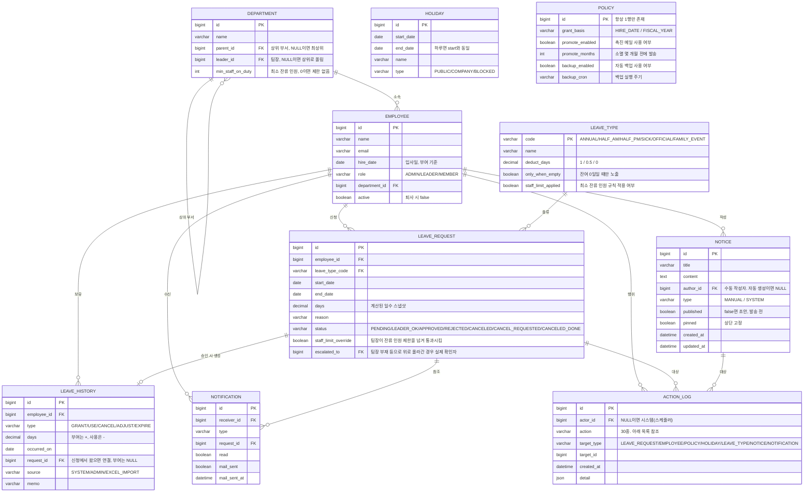

# DB 설계·프로젝트 메모리 V01

| 항목 | 내용 |
| --- | --- |
| 버전 | V01 |
| 기록일 | 2026-09-18 |
| 용도 | 다음 작업에서 다시 참조할 DB 설계 메모리 |
| 기준 | Notion 논리 ERD와 관련 DB 정책 |
| 출처 | [휴가관리 시스템 V2 — 설계 문서](https://app.notion.com/p/3de2735d989181df93e7f7670927c0c9) |
| 원문 최근 수정 | 2026-09-18 08:01:36 UTC, 도구 조회 기준 |
| 관련 문서 | [초기설계-V01.md](./초기설계-V01.md) |
| 구성 | 테이블 10개, 컬럼 69개, 원본 ERD, 코드·제약·트랜잭션·미결 사항 |

> 이 파일은 저장소에 남기는 참조 문서다. Notion 설계를 기록한 것이며 실제 DB나 마이그레이션의 구현 완료를 의미하지 않는다. 에이전트가 자동으로 읽는 설정 파일은 아니다. 원문에 없는 타입 길이·NULL 정책·기본값·제약을 확정 사항으로 추가하지 않았다.

## 1. 다음 작업에서 먼저 기억할 기준

1. 잔여 연차는 별도 컬럼에 저장하지 않고 사원별 `LEAVE_HISTORY.days` 합계로 계산한다.
2. 정상 신청의 사용 차감은 관리자 최종 승인 시에만 기록한다. 과거 엑셀 이관은 별도 출처로 사용 원장을 생성한다.
3. 사용 차감과 취소 복구를 구분한다. 승인 전 취소는 원장 변화가 없고, 승인 후 취소 승인은 양수 취소 원장을 만든다.
4. `UNIQUE(request_id, type)`으로 같은 신청·유형의 중복 원장을 방지한다.
5. 신청은 변경되는 현재 상태, 이벤트로그는 추가만 하는 이력, 알림은 수신자별 표시·발송 상태다.
6. 퇴사자는 삭제하지 않고 비활성화한다.
7. 결재선은 사원 → 팀장 확인 → 관리자 승인이다. 팀장 부재·미지정은 상위 확인, 팀장 본인 신청은 1차 확인을 생략한다.
8. 연차·경조사에는 직속 부서의 최소 잔류 인원을 적용한다. 반차·병가·공가는 현재 제외다.
9. Flyway는 스키마 이력을 관리한다. DB 전체 백업은 별도 mysqldump다.
10. 이번 기록 작업의 편집 범위는 이 문서뿐이다. 설정·엔티티·DDL의 변경은 포함하지 않는다.

## 2. 원본 ERD

Notion의 Mermaid ERD를 그대로 가져왔다. 원본의 관계 수와 누락된 연결선도 보존했다. 따라서 아래 그림 자체를 확정 물리 스키마로 사용하지 말고 9장의 불일치 목록을 함께 읽는다.

## 3. 테이블과 컬럼 사전

타입은 원본 ERD 표기를 따른다. `varchar` 길이와 일반 `decimal` 정밀도는 대부분 미정이다. PK/FK 표시는 원본에 기재된 표시이며 실제 DDL 존재를 의미하지 않는다. 원문이 NULL을 명시한 경우만 설명에 표시했다.

### 3.1. DEPARTMENT — 부서

| 컬럼 | 원문 타입 | 키 | 의미 |
| --- | --- | --- | --- |
| `id` | `bigint` | PK | 식별자 |
| `name` | `varchar` | — | 이름 |
| `parent_id` | `bigint` | FK | 상위 부서, NULL이면 최상위 |
| `leader_id` | `bigint` | FK | 팀장, NULL이면 상위로 올림 |
| `min_staff_on_duty` | `int` | — | 최소 잔류 인원, 0이면 제한 없음 |

부서 계층은 깊이를 제한하지 않으며 MySQL 8 재귀 CTE로 하위를 조회한다. `parent_id`는 최상위에서 NULL, `leader_id`는 팀장 미지정 시 NULL이다. `min_staff_on_duty=0`은 제한 없음이라는 의미이며 DB 기본값을 확정한 것은 아니다. 부서 순환 참조 방지와 팀장 소속 검증은 추가 설계가 필요하다.

### 3.2. EMPLOYEE — 사원

| 컬럼 | 원문 타입 | 키 | 의미 |
| --- | --- | --- | --- |
| `id` | `bigint` | PK | 식별자 |
| `name` | `varchar` | — | 이름 |
| `email` | `varchar` | — | 이메일 |
| `hire_date` | `date` | — | 입사일, 부여 기준 |
| `role` | `varchar` | — | ADMIN/LEADER/MEMBER |
| `department_id` | `bigint` | FK | 소속 부서 |
| `active` | `boolean` | — | 퇴사 시 false |

사번 필드는 사용하지 않는다. 퇴사 시 삭제하지 않고 `active=false`로 전환하여 과거 신청·원장·로그를 보존한다. 로그인 수단이 미정이므로 비밀번호·사내 계정 연결 필드는 아직 없다. 이메일 UNIQUE 여부와 부서 미배정 허용 여부도 미정이다.

### 3.3. LEAVE_TYPE — 휴가 종류

| 컬럼 | 원문 타입 | 키 | 의미 |
| --- | --- | --- | --- |
| `code` | `varchar` | PK | ANNUAL/HALF_AM/HALF_PM/SICK/OFFICIAL/FAMILY_EVENT |
| `name` | `varchar` | — | 이름 |
| `deduct_days` | `decimal` | — | 1 / 0.5 / 0 |
| `only_when_empty` | `boolean` | — | 잔여 0일일 때만 노출 |
| `staff_limit_applied` | `boolean` | — | 최소 잔류 인원 규칙 적용 여부 |

결재선은 모든 휴가 종류가 같아 별도 결재선 컬럼을 두지 않는다. 규칙은 정해진 코드와 차감·노출·잔류 인원 필드로 표현한다. 코드별 값은 5장에 정리했다.

### 3.4. LEAVE_REQUEST — 휴가 신청

| 컬럼 | 원문 타입 | 키 | 의미 |
| --- | --- | --- | --- |
| `id` | `bigint` | PK | 식별자 |
| `employee_id` | `bigint` | FK | 대상 사원 |
| `leave_type_code` | `varchar` | FK | 휴가 종류 |
| `start_date` | `date` | — | 시작일 |
| `end_date` | `date` | — | 종료일 |
| `days` | `decimal` | — | 계산된 일수 스냅샷 |
| `reason` | `varchar` | — | 신청 사유 |
| `status` | `varchar` | — | PENDING/LEADER_OK/APPROVED/REJECTED/CANCELED/CANCEL_REQUESTED/CANCELED_DONE |
| `staff_limit_override` | `boolean` | — | 팀장이 잔류 인원 제한을 넘겨 통과시킴 |
| `escalated_to` | `bigint` | FK | 팀장 부재 등으로 위로 올라간 경우 실제 확인자 |

현재 업무 상태를 저장하며 승인 이력은 ACTION_LOG로 분리한다. `days`는 신청 일수 스냅샷이다. 팀장확인·상위확인은 `LEADER_OK` 하나로 표현하고 상위 처리자는 `escalated_to`로 구분한다. 실제 FK 대상은 필드 의미상 EMPLOYEE로 해석되지만 원본 ERD 연결선에는 생략되어 있다.

### 3.5. LEAVE_HISTORY — 연차 원장

| 컬럼 | 원문 타입 | 키 | 의미 |
| --- | --- | --- | --- |
| `id` | `bigint` | PK | 식별자 |
| `employee_id` | `bigint` | FK | 대상 사원 |
| `type` | `varchar` | — | GRANT/USE/CANCEL/ADJUST/EXPIRE |
| `days` | `decimal` | — | 부여는 +, 사용은 - |
| `occurred_on` | `date` | — | 원장 발생일 |
| `request_id` | `bigint` | FK | 신청에서 왔으면 연결, 부여는 NULL |
| `source` | `varchar` | — | SYSTEM/ADMIN/EXCEL_IMPORT |
| `memo` | `varchar` | — | 원장 메모 |

잔여의 유일한 계산 근거다. 본문은 `days`를 DECIMAL(4,1)로 명시한다. `request_id`는 신청 유래일 때 연결하고 부여는 NULL이다. 엑셀 이관 행의 신청 연결 여부는 미정이다. UNIQUE(request_id, type)과 (employee_id, occurred_on) 인덱스를 원문에서 지정했다.

### 3.6. HOLIDAY — 휴일·신청 금지 기간

| 컬럼 | 원문 타입 | 키 | 의미 |
| --- | --- | --- | --- |
| `id` | `bigint` | PK | 식별자 |
| `start_date` | `date` | — | 시작일 |
| `end_date` | `date` | — | 하루면 start와 동일 |
| `name` | `varchar` | — | 이름 |
| `type` | `varchar` | — | PUBLIC/COMPANY/BLOCKED |

하루도 시작일과 종료일을 같게 저장한다. 기간 전체를 한 행으로 표현할 수 있다. 공휴일은 향후 API 동기화, 사내휴일·신청금지는 관리자가 등록한다. 정책·휴일은 특정 사원·신청에 종속되지 않는다.

### 3.7. NOTIFICATION — 알림

| 컬럼 | 원문 타입 | 키 | 의미 |
| --- | --- | --- | --- |
| `id` | `bigint` | PK | 식별자 |
| `receiver_id` | `bigint` | FK | 알림 수신 사원 |
| `type` | `varchar` | — | 알림 종류: 코드 목록 미정 |
| `request_id` | `bigint` | FK | 관련 신청 |
| `read` | `boolean` | — | 알림 읽음 여부 |
| `mail_sent` | `boolean` | — | 메일 발송 여부 |
| `mail_sent_at` | `datetime` | — | 메일 발송 시각 |

사람에게 보여줄 현재 상태와 메일 결과를 보관한다. 발송·실패·읽음 이력은 ACTION_LOG에도 남긴다. 신청과 무관한 공지·백업 실패·촉진 알림의 참조 구조와 request_id의 NULL 허용 범위는 아직 정의되어 있지 않다.

### 3.8. ACTION_LOG — 이벤트로그

| 컬럼 | 원문 타입 | 키 | 의미 |
| --- | --- | --- | --- |
| `id` | `bigint` | PK | 식별자 |
| `actor_id` | `bigint` | FK | NULL이면 시스템(스케줄러) |
| `action` | `varchar` | — | 30종. 아래 목록 참조 |
| `target_type` | `varchar` | — | LEAVE_REQUEST/EMPLOYEE/POLICY/HOLIDAY/LEAVE_TYPE/NOTICE/NOTIFICATION |
| `target_id` | `bigint` | — | 로그 대상 식별자 |
| `created_at` | `datetime` | — | 생성 시각 |
| `detail` | `json` | — | 행위 상세와 변경 전후 값 |

append-only 업무 이력이다. 시스템 작업은 actor_id=NULL이다. target_type + target_id로 여러 업무 대상을 구분하므로 원본의 대상 연결선을 모두 물리 FK로 해석하면 안 된다. 타입별 대상 키 호환성은 9장에서 다룬다.

### 3.9. POLICY — 정책

| 컬럼 | 원문 타입 | 키 | 의미 |
| --- | --- | --- | --- |
| `id` | `bigint` | PK | 항상 1행만 존재 |
| `grant_basis` | `varchar` | — | HIRE_DATE / FISCAL_YEAR |
| `promote_enabled` | `boolean` | — | 촉진 메일 사용 여부 |
| `promote_months` | `int` | — | 소멸 몇 개월 전에 발송 |
| `backup_enabled` | `boolean` | — | 자동 백업 사용 여부 |
| `backup_cron` | `varchar` | — | 백업 실행 주기 |

키-값 방식이 아니라 컬럼별 타입을 갖는 단일 행이다. '한 행만 존재'는 논리 규칙이며 id=1 고정이나 DB 강제 방식까지 정해진 것은 아니다. 설정 컬럼 추가 시 기존 행을 위해 NOT NULL DEFAULT를 지정한다는 원문 방침이 있다.

### 3.10. NOTICE — 공지

| 컬럼 | 원문 타입 | 키 | 의미 |
| --- | --- | --- | --- |
| `id` | `bigint` | PK | 식별자 |
| `title` | `varchar` | — | 공지 제목 |
| `content` | `text` | — | 공지 본문 |
| `author_id` | `bigint` | FK | 수동 작성자. 자동 생성이면 NULL |
| `type` | `varchar` | — | MANUAL / SYSTEM |
| `published` | `boolean` | — | false면 초안, 발송 전 |
| `pinned` | `boolean` | — | 상단 고정 |
| `created_at` | `datetime` | — | 생성 시각 |
| `updated_at` | `datetime` | — | 수정 시각 |

MANUAL은 수동 공지, SYSTEM은 정책 변경 자동 공지다. 자동 공지는 published=false 초안으로 시작하고 관리자가 확인 후 게시·발송한다. 사원은 published=true만 조회한다. 자동 생성 시 author_id=NULL이라는 ERD와 정책 변경 관리자를 로그 행위자로 기록한다는 본문을 구분해 보존한다.

## 4. 관계·제약·인덱스

### 4.1 참조 관계

| 자식 컬럼 | 참조 대상 | 근거와 상태 |
| --- | --- | --- |
| DEPARTMENT.parent_id | DEPARTMENT.id | 원문 자기 참조, 최상위는 NULL |
| DEPARTMENT.leader_id | EMPLOYEE.id | 원문 '팀장' 의미로 해석, 연결선 생략, 미지정은 NULL |
| EMPLOYEE.department_id | DEPARTMENT.id | 원문 소속 관계 |
| LEAVE_REQUEST.employee_id | EMPLOYEE.id | 원문 신청자 관계 |
| LEAVE_REQUEST.leave_type_code | LEAVE_TYPE.code | 원문 휴가 종류 관계 |
| LEAVE_REQUEST.escalated_to | EMPLOYEE.id | 원문 실제 상위 확인자 의미로 해석, 연결선 생략 |
| LEAVE_HISTORY.employee_id | EMPLOYEE.id | 원문 사원 원장 관계 |
| LEAVE_HISTORY.request_id | LEAVE_REQUEST.id | 신청에서 발생한 원장, 부여는 NULL |
| NOTIFICATION.receiver_id | EMPLOYEE.id | 원문 수신자 관계 |
| NOTIFICATION.request_id | LEAVE_REQUEST.id | 원문 참조 신청 관계 |
| ACTION_LOG.actor_id | EMPLOYEE.id | 원문 행위자, 시스템은 NULL |
| NOTICE.author_id | EMPLOYEE.id | 원문 작성자, 자동 생성은 NULL |
| ACTION_LOG.target_type + target_id | 종류별 업무 대상 | 논리적 연결, 단일 물리 FK 대상으로 확정되지 않음 |

원본의 DEPARTMENT 자기 참조 선은 부모가 항상 하나 있는 모양이지만, 컬럼 설명은 최상위 부모 NULL을 허용한다. NOTICE 작성자와 ACTION_LOG 행위자 선도 시스템 생성 시의 NULL을 충분히 표현하지 않는다. 필수 여부는 컬럼 설명과 함께 해석해야 한다.

### 4.2 명시된 제약과 조회 인덱스

| 대상 | 내용 | 목적 |
| --- | --- | --- |
| LEAVE_HISTORY | UNIQUE(request_id, type) | 동일 신청의 동일 유형 중복 차감·복구 방지 |
| LEAVE_HISTORY | INDEX(employee_id, occurred_on) | 사원별 원장·기간 조회 |
| ACTION_LOG | INDEX(target_type, target_id, created_at) | 대상별 이력 조회 |
| ACTION_LOG | INDEX(actor_id, created_at) | 행위자별 이력 조회 |
| ACTION_LOG | INDEX(created_at) | 시각 기준 이력 조회 |
| POLICY | 논리적으로 1행만 존재 | 회사 설정 한 벌 관리 |

원문에는 추가 FK 인덱스, 이메일 유일성, 날짜 CHECK, 부서 순환 방지, ID 생성 전략, ON DELETE/ON UPDATE 정책이 없다. `request_id`가 없는 부여·소멸·이관의 중복 실행 방지는 위 유일성 규칙만으로 정의되어 있지 않다.

## 5. 코드와 기준 데이터

### 5.1 역할

| 코드 | 범위 |
| --- | --- |
| ADMIN | 전체 조회, 최종 승인, 관리 기능 |
| LEADER | 사원 기능 + 자기 팀 조회·1차 확인·반려 |
| MEMBER | 본인 신청·이력·잔여, 팀의 오늘 출근·휴가 현황 |

서버 쿼리에서 권한과 소속 조건을 강제한다. 팀장의 하위 부서 조회 범위는 미정이다.

### 5.2 휴가 종류 초기 기준

아래는 원문의 업무 기준이다. 이미 삽입된 시드 데이터라는 뜻은 아니다.

| code | 이름 | deduct_days | only_when_empty | staff_limit_applied | 기간 제한 |
| --- | --- | --- | --- | --- | --- |
| ANNUAL | 연차 | 1 | 별도 제한 미기재 | true | 기간 신청 |
| HALF_AM | 오전 반차 | 0.5 | 별도 제한 미기재 | false | 하루만 |
| HALF_PM | 오후 반차 | 0.5 | 별도 제한 미기재 | false | 하루만 |
| SICK | 병가 | 0 | true | false | 별도 제한 미기재 |
| OFFICIAL | 공가 | 0 | true | false | 별도 제한 미기재 |
| FAMILY_EVENT | 경조사 | 0 | 별도 제한 미기재 | true | 별도 제한 미기재 |

`deduct_days`는 종류의 차감 단위이고 `LEAVE_REQUEST.days`는 기간을 계산한 신청 스냅샷이다. 잔여가 0.5일일 때 병가·공가를 허용할지는 미정이다.

### 5.3 신청 상태

| 코드 | 의미 | 원장 영향 |
| --- | --- | --- |
| PENDING | 신청 대기 | 없음 |
| LEADER_OK | 팀장·상위 부서장 확인 완료 | 없음 |
| APPROVED | 관리자 최종 승인 | 차감 대상이면 USE 음수 행 |
| REJECTED | 반려 | 승인 전 반려는 없음 |
| CANCELED | 승인 전 본인 취소 | 없음 |
| CANCEL_REQUESTED | 승인 건 취소 요청 | 요청만으로 복구하지 않음 |
| CANCELED_DONE | 승인 건 취소 완료 | 기존 차감에 대응하는 CANCEL 양수 행 |

팀장 본인 신청이 1차 확인 없이 관리자에게 갈 때의 DB 상태값, 확인 완료 후 본인 취소 허용 여부, 관리자 직접 취소의 상세 전이는 미정이다.

### 5.4 원장 코드

| 분류 | 코드 | 의미 |
| --- | --- | --- |
| type | GRANT | 부여, 양수 |
| type | USE | 사용, 음수 |
| type | CANCEL | 차감된 휴가 취소 복구, 양수 |
| type | ADJUST | 관리자 정정, 양수 또는 음수 |
| type | EXPIRE | 미사용분 소멸, 음수 |
| source | SYSTEM | 자동 처리 |
| source | ADMIN | 관리자 처리 |
| source | EXCEL_IMPORT | 엑셀 이관 |

### 5.5 기타 코드

| 컬럼 | 값 |
| --- | --- |
| HOLIDAY.type | PUBLIC / COMPANY / BLOCKED |
| POLICY.grant_basis | HIRE_DATE / FISCAL_YEAR |
| NOTICE.type | MANUAL / SYSTEM |
| ACTION_LOG.target_type | LEAVE_REQUEST / EMPLOYEE / POLICY / HOLIDAY / LEAVE_TYPE / NOTICE / NOTIFICATION |

회계연도 기준은 코드만 준비하며 MVP 부여 로직은 입사일 기준이다. NOTIFICATION.type의 실제 enum 문자열 목록은 원문에 없다.

### 5.6 이벤트로그 action 30종

| 구분 | 코드 | 행위자 |
| --- | --- | --- |
| 신청 | APPLY, PROXY_APPLY, LEADER_CONFIRM, APPROVE, REJECT, SELF_CANCEL, CANCEL_REQUEST, CANCEL_APPROVE, CANCEL_REJECT | 해당 업무 행위자 |
| 자동 원장 | GRANT, EXPIRE | NULL, 시스템 |
| 정정·이관 | ADJUST, EXCEL_IMPORT | 관리자 |
| 사원 | EMPLOYEE_CREATE, EMPLOYEE_UPDATE, EMPLOYEE_DEACTIVATE, DEPARTMENT_CHANGE, ROLE_CHANGE | 관리자 |
| 설정 | POLICY_CHANGE, HOLIDAY_ADD, HOLIDAY_DELETE, LEAVE_TYPE_CHANGE | 관리자 |
| 공지 | NOTICE_CREATE, NOTICE_UPDATE, NOTICE_DELETE | 관리자, 자동 생성은 정책 변경 관리자 |
| 알림 발송 | NOTIFY_SENT, MAIL_SENT, MAIL_FAILED | NULL, 시스템 |
| 알림 읽음 | NOTIFY_READ | 사원 |
| 배치 | BATCH_FAILED | NULL, 시스템 |

enum은 문자열로 저장한다. 로그인·로그아웃은 현재 기록 범위에서 제외하며, 배치 성공 자체 대신 실패를 기록한다. 단, GRANT·EXPIRE 업무 이벤트는 배치 한 건이 아니라 사원당 한 건이다. 부서 변경 detail에는 부서 ID와 이름을 함께 남긴다.

## 6. 데이터 변경 규칙과 정합성

### 6.1 원장

- 사원별 잔여는 SUM(days)다. 잔여 컬럼이나 별도 캐시를 기준으로 계산하지 않는다.
- 0.5일 단위까지 사용한다. 본문은 시간차 미사용으로 적었지만 미결 목록에 도입 검토가 남아 있다.
- 대기 신청은 잔여에서 차감하지 않고 대기 건수로 표시한다. '가용 잔여' 별도 표시 여부는 미결이다.
- 승인 시 잔여 부족이면 거부한다. 당겨쓰기 허용 시 요구사항과 정책을 변경해야 한다.
- 입사일 기준 부여·기산일 소멸·이월 없음이 원문의 기준이다. 출근율 데이터 부재로 예외는 관리자 정정 방식이며 회사 정책 확인이 남아 있다.
- 휴일 변경 후 승인 스냅샷 재계산 여부는 미정이다. 기존 스냅샷 유지 + 정정이 원문 제안이다.

### 6.2 잠금과 트랜잭션

| 작업 | 원문 처리 방향 |
| --- | --- |
| 기간 중복 신청 | 사원 행 잠금 → 겹침 확인 → 신청 삽입을 같은 트랜잭션으로 수행 |
| 승인·차감 | 잔여 확인·상태 변경·원장 기록을 트랜잭션으로 처리 |
| 중복 처리 | SELECT FOR UPDATE, 조건부 UPDATE, 원장 UNIQUE 조합 |
| 잔류 인원 검사 | 부서 행을 잠그고 신청 기간의 근무일마다 확인 |
| 업무 로그 | 본 작업과 같은 트랜잭션, 로그만 REQUIRES_NEW로 분리하지 않음 |
| 알림·메일 | 알림 행 저장과 외부 메일 전송을 구분, 메일은 커밋 후 비동기·실패 재시도 |

서로 다른 신청을 동시에 승인할 때의 사원 잔여 보호, 잠금 획득 순서, 조건부 UPDATE 조건, 충돌 재시도는 상세 구현에서 정의해야 한다. UNIQUE만으로 모든 동시 승인 잔여 검증이 완성되는 것은 아니다.

### 6.3 최소 잔류 인원

- 모수는 직속 부서의 활성 사원 수다. 하위 부서를 합산하지 않는다.
- 원문은 승인 휴가와 대기 신청을 함께 세고 화면에서는 구분 표시한다.
- 신청은 막지 않고 경고한다. 팀장이 초과를 허용하면 staff_limit_override를 기록한다.
- 관리자는 이 플래그가 있을 때만 초과 승인할 수 있다.
- 근무일별 `활성 팀원 수 - 기존 휴가 인원 - 신청자 1명 < 최소 잔류 인원`이면 제한 초과다.
- 대기 상태의 정확한 집계 범위, 본인 신청 제외, 중복 인원 집계, 장기 부재자 모수 제외는 추가 확인이 필요하다.

### 6.4 공지와 알림

- 정책 변경 시 SYSTEM 공지 초안을 생성하고 관리자가 게시하면 수신자 알림을 만든다.
- grant_basis와 promote_months 변경은 공지 대상, backup_cron과 backup_enabled는 제외다.
- 정책 변경 전후 값은 ACTION_LOG.detail을 사용한다.
- 사원에게는 published=true만 노출한다. 이미 게시된 공지 수정은 알림 재발송 사유가 아니다.
- 알림 테이블은 현재 읽음·발송 상태, 로그는 각 발송·실패·읽음의 이력을 보관한다.
- 실제 메일은 AFTER_COMMIT + Async 방식이며 실패 시 재시도한다. 재시도 상태 모델은 미정이다.

## 7. 조회·이관·스키마 운영

### 조회

- JPA로 일반 CRUD를 처리하고 리포트와 부서 재귀 조회는 네이티브 SQL을 사용한다.
- 모든 목록은 20건 페이지네이션한다.
- 연차 현황은 부서·사원·기간으로 필터링하고 다운로드도 같은 조건을 사용한다.
- 이벤트로그 JSON 상세의 전문 검색은 범위에서 제외한다. 자주 찾는 값은 필요할 때 컬럼으로 분리한다.

### 엑셀 이관

- 기존 엑셀은 하루 한 행이다. (*)는 0.5일, 표시가 없으면 1일로 해석한다.
- 표시를 제거한 뒤 날짜를 파싱하고 오류 행은 모아 사전에 보여준다.
- 한 행마다 EXCEL_IMPORT 출처의 USE 음수 원장을 만든다.
- 입사일 기준 GRANT 부여분을 생성하고 사원별 엑셀 잔여·시스템 잔여·차이를 대조한다.
- 승인 완료 신청도 생성할지는 미정이다. 따라서 이관 원장의 request_id 연결 정책도 미정이다.
- 반차의 오전·오후 정보가 없는 기존 데이터의 표현과 동일 파일 재이관 방지도 후속 설계가 필요하다.

### 스키마와 운영

- DB는 MySQL 8, 스키마 변경 이력은 Flyway로 관리한다.
- POLICY에 필수 컬럼 추가 시 기존 행을 고려한 NOT NULL DEFAULT를 지정한다.
- DB 데이터는 Docker 호스트 경로에 보관한다.
- DB 전체 백업은 mysqldump, 백업 파일은 DB와 다른 디스크에 저장한다.
- 복원에는 확인 단계와 로그가 필요하며 실제 복구 검증을 수행한다.
- 엑셀 리포트는 DB 백업을 대신하지 않는다.
- 스케줄러 실행 로그를 사용한다는 방향은 있지만 해당 테이블은 원본 ERD에 없다.

## 8. 범위 메모

| 구분 | 관련 DB 기능 |
| --- | --- |
| MVP | 사원·부서·종류, 신청·확인·승인·반려·대기 취소, 원장·부여·소멸, 휴일 수동 관리 |
| MVP | 알림·메일, 엑셀 이관·잔액 대조, 리포트, 관리자 대리 등록·삭제·직접 취소, 이벤트로그 기록 |
| 후순위 | 사원 취소요청 처리, 공휴일 API 동기화, 촉진 메일, 백업·복원 제품 기능, 이벤트로그 조회 화면 |
| 재확인 | 공지사항의 MVP 포함 여부, 시간차 |
| 현재 제외 | 회계연도 기준 부여 로직, 공지 첨부파일 |

테이블·코드가 ERD에 존재한다는 사실과 MVP에서 모든 기능을 구현한다는 판단은 구분한다.

## 9. 원문 불일치와 DDL 작성 전 확인 사항

다음은 문서 정리 과정에서 식별한 항목이며 확정 설계로 반영하지 않았다.

| 번호 | 항목 | 확인할 내용 |
| --- | --- | --- |
| DB-01 | 신청-원장 관계 수 | 원본은 0..1이나 USE와 CANCEL을 함께 저장하면 한 신청에 복수 원장이 생긴다. 1:N 관계로 정리할지 확인 |
| DB-02 | 선택적 참조 | 최상위 부서·시스템 행위자·자동 공지 작성자의 NULL 의미를 관계도에도 반영 |
| DB-03 | 로그 대상 키 타입 | target_id는 bigint인데 LEAVE_TYPE의 PK는 varchar code다. 타입별 키 표현을 결정 |
| DB-04 | 다형 대상 FK | ACTION_LOG의 대상 연결은 논리 관계다. 여러 테이블로 향하는 target_id의 무결성 보장 방식 결정 |
| DB-05 | 부서 로그 | DEPARTMENT_CHANGE는 있으나 DEPARTMENT가 target_type에 없다. 사원 대상 변경과 부서 자체 관리 로그의 매핑 결정 |
| DB-06 | 공지 알림 참조 | NOTIFICATION에는 request_id만 있어 공지·촉진·백업 실패 참조가 불명확 |
| DB-07 | 공지 작성자 | SYSTEM 공지 author_id=NULL과 정책 변경 관리자를 로그 actor로 남기는 구분 확정 |
| DB-08 | 원장 정밀도 | LEAVE_HISTORY.days는 본문 DECIMAL(4,1), 다른 decimal의 precision/scale은 미정 |
| DB-09 | 기본 DDL | varchar 길이, NULL, DEFAULT, AUTO_INCREMENT/ID 전략, FK 삭제·수정 정책 결정 |
| DB-10 | 원장 중복 방지 | request_id 없는 자동 부여·소멸·이관의 재실행 식별자와 유일성 규칙 필요 |
| DB-11 | 관리자 대기 | 팀장 본인 신청이 1차 확인을 생략할 때의 상태값 결정 |
| DB-12 | 취소·대리 삭제 | 승인 전·후 원장 영향, 물리 삭제 여부, 상태·action 매핑 확정 |
| DB-13 | 스케줄러 실행 로그 | 테이블, 실행 키, 실패·재실행·누락분 보정 모델 정의 |
| DB-14 | 메일 재시도 | 재시도 횟수·다음 시각·오류·재기동 복구에 필요한 저장 필드 결정 |
| DB-15 | 로그인·세션 | 인증 수단과 세션 저장소 결정 후 필요한 컬럼·테이블 검토 |
| DB-16 | 정책 누락 필드 | 관리자 전용 알림 선택 등 본문에만 있는 설정의 모델 반영 여부 결정 |
| DB-17 | 공지 발송 중복 | published 검사와 갱신·알림 생성의 원자성 보장 방식 결정 |
| DB-18 | 부서 무결성 | 부서 순환, 팀장 소속, 조직 변경 후 결재자·조회 범위 처리 결정 |
| DB-19 | 보관 정책 | 이벤트로그 보관 기간·아카이빙, 사원·부서·신청 삭제 시 이력 유지 규칙 확정 |
| DB-20 | 변경 이력의 시점 | occurred_on은 업무 발생일이다. 뒤늦은 정정·이관을 포함해 '당시 보였던 잔액'까지 복원할지에 따라 기록 시각 필요성 검토 |

## 10. 이 문서를 갱신할 때

- Notion의 확정 사항, 구현 상태, 제안을 섞지 않고 구분해서 기록한다.
- DDL과 엔티티는 별도 작업자가 수정 중일 수 있으므로 이 문서만으로 실제 구현 상태를 단정하지 않는다.
- 확정 결정이 바뀌면 원문 출처·변경 이유·영향 테이블을 다음 버전에 남긴다.
- 설계 전체 맥락은 [초기설계-V01.md](./초기설계-V01.md), DB 상세는 이 문서를 함께 참조한다.

## 11. 출처

- [Leave-System](https://app.notion.com/p/3db2735d9891805fa4e6e0bf4927f054): 프로젝트 상위 페이지.
- [휴가관리 시스템 V2 — 설계 문서](https://app.notion.com/p/3de2735d989181df93e7f7670927c0c9): 4장 핵심 데이터, 5장 원본 ERD·업무 흐름, 6장 권한·공지·로그, 7장 알림, 8장 휴가 코드, 9장 이관, 10장 백업, 11·12장 기술·결정, 13~15장 미결·범위.
- 2026-09-18에 하위 문서 전체 본문을 조회했다. 이 문서의 원본 ERD와 컬럼 사전은 동일 조회 결과에서 추출했다.
