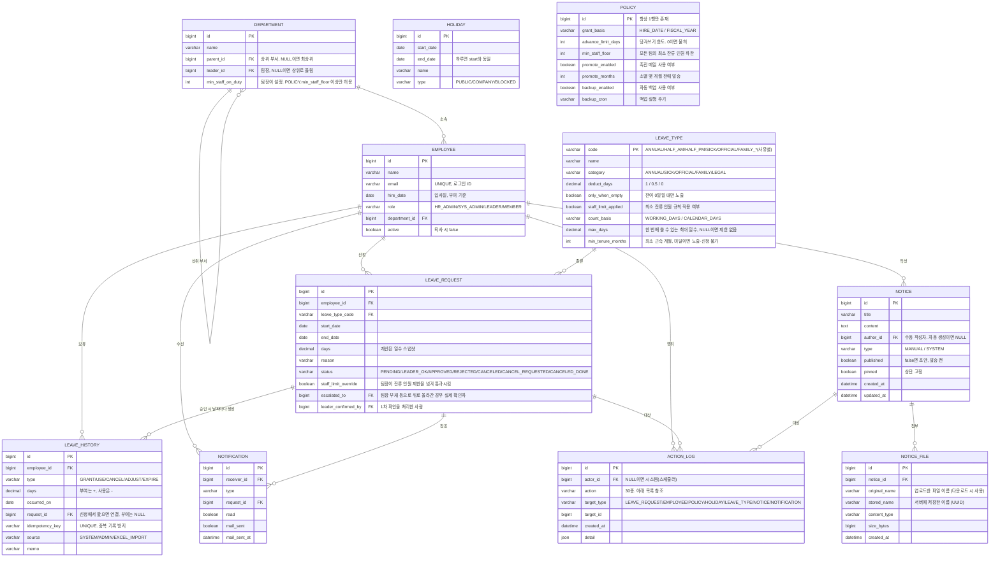

# DB 설계·프로젝트 메모리 V02

| 항목 | 내용 |
| --- | --- |
| 버전·기록일 | V02 · 2026-09-21 |
| 출처 | [Notion 설계 문서](https://app.notion.com/p/3de2735d989181df93e7f7670927c0c9) |
| 도구 보고 원문 수정 | 2026-09-21T07:22:33.827Z |
| 구성 | 원본 ERD, 테이블 11개·컬럼 84개, 데이터 규칙·결정·미결 사항 |
| 전체 설계 | [초기설계-V02](./초기설계-V02.md) |
| 이전 기록 | [DB설계-V01](./DB설계-V01.md) |
| 근거 보존 | [Notion설계-2026-09-21](./원문/Notion설계-2026-09-21.md) |

저장소에서 다음 설계 작업에 참조할 메모리 문서다. 자동 로드 설정이나 구현 완료 선언은 아니다. 원문 ERD와 본문이 충돌하면 차이를 남긴다. 길이·NULL·기본값·삭제 정책 등 미기재 물리 제약은 임의로 확정하지 않는다.

## 1. V01에서 바뀐 기준

- 역할 ADMIN 통합을 HR_ADMIN / SYS_ADMIN 분리로 바꾼다.
- LEAVE_HISTORY.idempotency_key를 추가하고 UNIQUE를 둔다. **UNIQUE(request_id, type)는 더 이상 최신 설계가 아니다.**
- POLICY.advance_limit_days, POLICY.min_staff_floor를 추가한다.
- 승인 잠금은 **부서 → 사원**, 잔여 SUM은 사원 잠금 이후다.
- 잔여는 입사일 기산 기간의 occurred_on 범위로 조회한다. 기간 컬럼은 추가하지 않는다.
- 당겨쓰기를 한도 내 허용한다. 음수 기간 마감은 ADJUST 양수·음수 쌍으로 넘긴다.
- 소멸된 기간의 취소는 거부한다.
- 경고 집계에는 대기를 포함하고 승인 차단에는 APPROVED만 포함한다.
- 엑셀은 신청 없이 원장만 이관한다.
- 캘린더는 회사 전체를 조회하지만 사유를 API 응답에 포함하지 않는다.

### 이번 V02 추가 변경

- LEAVE_TYPE에 category·count_basis·max_days·min_tenure_months(4개), LEAVE_REQUEST에 leader_confirmed_by(1개), NOTICE_FILE(7개)을 추가했다.
- 신청-이력 관계는 1:N, USE·CANCEL은 날짜별 행·날짜 포함 키로 확정됐다.
- 이메일 UNIQUE·로그인 ID를 명시했다. 운영 Google OAuth, 개발 dev 인메모리 비밀번호를 사용하고 EMPLOYEE 비밀번호 컬럼은 두지 않는다.
- 신청의 기산일 걸침 거부, 팀장·인사 본인 신청 LEADER_OK, 기간별 승인 잔여 검증이 핵심 API에 명시됐다.
- 승인 SQL에만 등장하는 approved_by·approved_at은 원본 ERD의 84개 컬럼에 포함하지 않는다.

## 2. 원본 ERD

아래는 이번 Notion 조회 결과의 ERD를 그대로 보존한 것이다. 신청-원장 관계는 이번에 1:N으로 수정됐다. 시스템 행위자의 선택적 참조 등 남은 원문 문제는 10장에 기록했다.



## 3. 컬럼 사전

타입·키 표시는 원본 ERD 기준이다. 본문이 days의 DECIMAL(4,1)을 따로 명시한 경우를 제외하면 decimal 정밀도와 varchar 길이는 미정이다.

### 3.1. DEPARTMENT — 부서

| 컬럼 | 원문 타입 | 키 | 의미 |
| --- | --- | --- | --- |
| `id` | `bigint` | PK | 식별자 |
| `name` | `varchar` | — | 이름 |
| `parent_id` | `bigint` | FK | 상위 부서, NULL이면 최상위 |
| `leader_id` | `bigint` | FK | 팀장, NULL이면 상위로 올림 |
| `min_staff_on_duty` | `int` | — | 팀장이 설정. POLICY.min_staff_floor 이상만 허용 |

parent_id는 최상위에서 NULL, leader_id는 팀장 미지정 시 NULL이다. 팀장은 min_staff_on_duty를 POLICY.min_staff_floor 이상으로 저장한다. 실제 적용은 두 값의 max다. 부모를 따라 올라가 자기 id가 나오면 저장을 거부하고, 재귀 조회에는 depth < 10을 둔다. '깊이 제한 없음'이라는 이전 본문도 남아 있어 10단계 초과 조직 허용 여부는 미정이다.

### 3.2. EMPLOYEE — 사원

| 컬럼 | 원문 타입 | 키 | 의미 |
| --- | --- | --- | --- |
| `id` | `bigint` | PK | 식별자 |
| `name` | `varchar` | — | 이름 |
| `email` | `varchar` | — | UNIQUE, 로그인 ID |
| `hire_date` | `date` | — | 입사일, 부여 기준 |
| `role` | `varchar` | — | HR_ADMIN/SYS_ADMIN/LEADER/MEMBER |
| `department_id` | `bigint` | FK | 소속 부서 |
| `active` | `boolean` | — | 퇴사 시 false |

역할은 HR_ADMIN / SYS_ADMIN / LEADER / MEMBER로 바뀌었다. 인사가 시스템 관리자 권한을 포함하므로 단일 role을 유지한다. 퇴사자는 active=false로 비활성화하며 사번은 사용하지 않는다. email은 UNIQUE 로그인 ID다. 운영 Google OAuth와 dev 폼 로그인 모두 이메일로 사전 등록 EMPLOYEE를 찾는다. 회사 도메인 외·미등록 계정은 거부한다. 비밀번호 컬럼·변경·재설정은 두지 않고 dev 비밀번호는 인메모리 설정에만 둔다. dev 사원 데이터는 Flyway dev 시드라는 원문 방향이다. 이메일 대소문자 정규화·변경·OAuth 식별자 연결과 미배정 부서 허용은 미정이다. 퇴사·권한 변경의 기존 세션 반영 방법도 별도 설계가 필요하다.

### 3.3. LEAVE_TYPE — 휴가 종류

| 컬럼 | 원문 타입 | 키 | 의미 |
| --- | --- | --- | --- |
| `code` | `varchar` | PK | ANNUAL/HALF_AM/HALF_PM/SICK/OFFICIAL/FAMILY_*(사유별) |
| `name` | `varchar` | — | 이름 |
| `category` | `varchar` | — | ANNUAL/SICK/OFFICIAL/FAMILY/LEGAL |
| `deduct_days` | `decimal` | — | 1 / 0.5 / 0 |
| `only_when_empty` | `boolean` | — | 잔여 0일일 때만 노출 |
| `staff_limit_applied` | `boolean` | — | 최소 잔류 인원 규칙 적용 여부 |
| `count_basis` | `varchar` | — | WORKING_DAYS / CALENDAR_DAYS |
| `max_days` | `decimal` | — | 한 번에 쓸 수 있는 최대 일수, NULL이면 제한 없음 |
| `min_tenure_months` | `int` | — | 최소 근속 개월, 미달이면 노출·신청 불가 |

기본 종류와 사유별 FAMILY_* 경조사를 category로 묶는다. 차감·노출·잔류 플래그에 계산 기준·일수·근속 조건이 추가됐다. 결재선 컬럼은 두지 않는다. 변경 권한은 인사 관리자에게 있다. 병가·공가도 현재는 팀장 확인과 인사 최종 승인을 거친다. 경조사는 기본 WORKING_DAYS, 근속 3개월(min_tenure_months=3)부터 노출·신청 가능하다. 종류·시작일만 받고 종료일은 서버가 계산한다. max_days는 ERD의 상한 설명과 달리 상세에서 고정 N일로 사용하므로 일부 일수 사용·NULL 처리 확인이 필요하다. 법정 장기 휴가 포함 여부는 미정이다. only_when_empty·근속 제한은 API에서도 재검증한다.

### 3.4. LEAVE_REQUEST — 휴가 신청

| 컬럼 | 원문 타입 | 키 | 의미 |
| --- | --- | --- | --- |
| `id` | `bigint` | PK | 식별자 |
| `employee_id` | `bigint` | FK | 대상 사원 |
| `leave_type_code` | `varchar` | FK | 휴가 종류 |
| `start_date` | `date` | — | 시작일 |
| `end_date` | `date` | — | 종료일 |
| `days` | `decimal` | — | 계산된 일수 스냅샷 |
| `reason` | `varchar` | — | 신청 사유 |
| `status` | `varchar` | — | PENDING/LEADER_OK/APPROVED/REJECTED/CANCELED/CANCEL_REQUESTED/CANCELED_DONE |
| `staff_limit_override` | `boolean` | — | 팀장이 잔류 인원 제한을 넘겨 통과시킴 |
| `escalated_to` | `bigint` | FK | 팀장 부재 등으로 위로 올라간 경우 실제 확인자 |
| `leader_confirmed_by` | `bigint` | FK | 1차 확인을 처리한 사람 |

계산된 days는 스냅샷이며 status는 현재 상태다. PENDING은 팀장 화면, LEADER_OK부터 인사 화면에 표시한다. escalated_to는 상위 확인자를 표현한다. 팀장·인사 본인 신청은 LEADER_OK로 시작한다. 1차 확인 처리자는 leader_confirmed_by에 저장한다. 기산일 걸침은 거부하며 경조사 종료일은 서버 계산이다. 승인 API의 UPDATE에는 approved_by·approved_at이 추가됐지만 ERD에는 없으므로 별도 설계 차이로 남긴다. 신청일·취소일 저장 방식도 아직 없다.

### 3.5. LEAVE_HISTORY — 연차 원장

| 컬럼 | 원문 타입 | 키 | 의미 |
| --- | --- | --- | --- |
| `id` | `bigint` | PK | 식별자 |
| `employee_id` | `bigint` | FK | 대상 사원 |
| `type` | `varchar` | — | GRANT/USE/CANCEL/ADJUST/EXPIRE |
| `days` | `decimal` | — | 부여는 +, 사용은 - |
| `occurred_on` | `date` | — | 원장 발생일 |
| `request_id` | `bigint` | FK | 신청에서 왔으면 연결, 부여는 NULL |
| `idempotency_key` | `varchar` | — | UNIQUE. 중복 기록 방지 |
| `source` | `varchar` | — | SYSTEM/ADMIN/EXCEL_IMPORT |
| `memo` | `varchar` | — | 원장 메모 |

새 idempotency_key에 UNIQUE를 둔다. 기존 UNIQUE(request_id, type)는 삭제하는 설계다. 본문 days 정밀도는 DECIMAL(4,1)이며 request_id는 부여 등 신청 외 행에서 NULL이다. 엑셀 이관도 신청을 만들지 않는다. USE는 실제 차감 날짜당 한 행(-1.0 또는 -0.5), CANCEL도 날짜별 대칭 행이다. 키는 USE:{신청id}:{날짜}, CANCEL:{신청id}:{날짜}다. 기간은 occurred_on 범위로 조회한다. 모든 INSERT를 서비스 한 곳으로 모으고 수동 변경은 인사만 허용한다.

### 3.6. HOLIDAY — 휴일·신청 금지

| 컬럼 | 원문 타입 | 키 | 의미 |
| --- | --- | --- | --- |
| `id` | `bigint` | PK | 식별자 |
| `start_date` | `date` | — | 시작일 |
| `end_date` | `date` | — | 하루면 start와 동일 |
| `name` | `varchar` | — | 이름 |
| `type` | `varchar` | — | PUBLIC/COMPANY/BLOCKED |

하루면 start_date=end_date이며 PUBLIC / COMPANY / BLOCKED로 나눈다. 계정·부서와 함께 시스템 관리자도 관리할 수 있다. 이후 휴일 지정으로 기존 원장을 바꾸는 행위는 인사 처리다. 복구는 전체 취소요청 → 인사 승인 → 날짜별 CANCEL(+)이며 부분 취소는 지원하지 않는다. 이전 ADJUST 복구 가정은 최신 질문 목록에서 제거됐다.

### 3.7. NOTIFICATION — 알림

| 컬럼 | 원문 타입 | 키 | 의미 |
| --- | --- | --- | --- |
| `id` | `bigint` | PK | 식별자 |
| `receiver_id` | `bigint` | FK | 알림 수신 사원 |
| `type` | `varchar` | — | 알림 종류: 코드 목록 미정 |
| `request_id` | `bigint` | FK | 관련 신청 |
| `read` | `boolean` | — | 알림 읽음 여부 |
| `mail_sent` | `boolean` | — | 메일 발송 여부 |
| `mail_sent_at` | `datetime` | — | 메일 발송 시각 |

현재 읽음·발송 상태를 보관한다. 신청 외 공지·촉진·백업 실패 및 영향받은 휴가 알림의 참조와 request_id NULL 허용 범위는 아직 정의가 부족하다. 재시도 횟수·시각·오류·중복 발송 방지 필드도 미정이다.

### 3.8. ACTION_LOG — 이벤트로그

| 컬럼 | 원문 타입 | 키 | 의미 |
| --- | --- | --- | --- |
| `id` | `bigint` | PK | 식별자 |
| `actor_id` | `bigint` | FK | NULL이면 시스템(스케줄러) |
| `action` | `varchar` | — | 30종. 아래 목록 참조 |
| `target_type` | `varchar` | — | LEAVE_REQUEST/EMPLOYEE/POLICY/HOLIDAY/LEAVE_TYPE/NOTICE/NOTIFICATION |
| `target_id` | `bigint` | — | 로그 대상 식별자 |
| `created_at` | `datetime` | — | 생성 시각 |
| `detail` | `json` | — | 행위 상세와 변경 전후 값 |

append-only 업무 이력이다. actor_id=NULL은 시스템 행위다. 인사 본인 최종 승인·반려는 detail에 self=true를 남긴다. 대상은 target_type과 target_id로 표현하는 논리 참조이며 일반 FK 목록으로 간주하지 않는다. 휴가 종류 PK가 varchar인 점과 target_id bigint의 호환성은 미해결이다.

### 3.9. POLICY — 정책

| 컬럼 | 원문 타입 | 키 | 의미 |
| --- | --- | --- | --- |
| `id` | `bigint` | PK | 항상 1행만 존재 |
| `grant_basis` | `varchar` | — | HIRE_DATE / FISCAL_YEAR |
| `advance_limit_days` | `int` | — | 당겨쓰기 한도. 0이면 불허 |
| `min_staff_floor` | `int` | — | 모든 팀의 최소 잔류 인원 하한 |
| `promote_enabled` | `boolean` | — | 촉진 메일 사용 여부 |
| `promote_months` | `int` | — | 소멸 몇 개월 전에 발송 |
| `backup_enabled` | `boolean` | — | 자동 백업 사용 여부 |
| `backup_cron` | `varchar` | — | 백업 실행 주기 |

컬럼 기반 단일 행이다. advance_limit_days와 min_staff_floor가 추가됐다. 한도 0은 당겨쓰기 불허이나 실제 초기값은 미정이다. grant_basis·advance_limit_days·promote_months·min_staff_floor 등 연차 정책은 인사, backup_enabled·backup_cron은 시스템/인사 권한이다. 필수 설정 컬럼 추가 시 NOT NULL DEFAULT를 둔다는 기존 방침을 유지한다.

### 3.10. NOTICE — 공지

| 컬럼 | 원문 타입 | 키 | 의미 |
| --- | --- | --- | --- |
| `id` | `bigint` | PK | 식별자 |
| `title` | `varchar` | — | 공지 제목 |
| `content` | `text` | — | 공지 본문 |
| `author_id` | `bigint` | FK | 수동 작성자. 자동 생성이면 NULL |
| `type` | `varchar` | — | MANUAL / SYSTEM |
| `published` | `boolean` | — | false면 초안, 발송 전 |
| `pinned` | `boolean` | — | 상단 고정 |
| `created_at` | `datetime` | — | 생성 시각 |
| `updated_at` | `datetime` | — | 수정 시각 |

MANUAL / SYSTEM으로 구분하며 자동 생성은 published=false 초안이다. 관리자가 검토·발송하고 사원은 published=true만 조회한다. 휴일 등록·동기화 공지가 새로 언급됐다. 게시 후 수정으로 알림을 다시 보내지 않는다. 공지 작성자와 정책 변경 로그 행위자는 구분해야 한다.

### 3.11. NOTICE_FILE — 공지 첨부파일

| 컬럼 | 원문 타입 | 키 | 의미 |
| --- | --- | --- | --- |
| `id` | `bigint` | PK | 식별자 |
| `notice_id` | `bigint` | FK | 소속 공지 |
| `original_name` | `varchar` | — | 업로드한 파일 이름 (다운로드 시 사용) |
| `stored_name` | `varchar` | — | 서버에 저장한 이름 (UUID) |
| `content_type` | `varchar` | — | 파일 MIME 타입 |
| `size_bytes` | `bigint` | — | 파일 크기(바이트) |
| `created_at` | `datetime` | — | 등록 시각 |

NOTICE 한 건에 첨부 여러 개다. 파일은 서버 디스크(Docker 볼륨), 메타데이터는 DB에 저장한다. 원본명은 다운로드에 쓰고 저장명은 UUID로 바꾼다. 로그인한 사원이 API로만 다운로드하며 파일 경로를 직접 공개하지 않는다. 허용 범주는 PDF·이미지·오피스 문서이고 구체 확장자·용량은 미정이다. mysqldump와 별개로 첨부 폴더를 백업해야 한다. 본문은 DB에 경로를 둔다고 하지만 ERD에는 stored_name만 있으므로 저장 루트·경로 조합, 삭제·초안 접근·파일/DB 원자성·복원 일치 방식은 보완해야 한다.

## 4. 관계·키·인덱스

| 자식 | 참조 대상 | 상태 |
| --- | --- | --- |
| DEPARTMENT.parent_id | DEPARTMENT.id | 최상위 NULL |
| DEPARTMENT.leader_id | EMPLOYEE.id | 팀장 의미로 해석, 원본 연결선 생략, 미지정 NULL |
| EMPLOYEE.department_id | DEPARTMENT.id | 소속 부서 |
| LEAVE_REQUEST.employee_id | EMPLOYEE.id | 신청자 |
| LEAVE_REQUEST.leave_type_code | LEAVE_TYPE.code | 휴가 종류 |
| LEAVE_REQUEST.escalated_to | EMPLOYEE.id | 상위 확인자 의미로 해석, 원본 연결선 생략 |
| LEAVE_REQUEST.leader_confirmed_by | EMPLOYEE.id | 실제 1차 확인자, 원본 연결선 생략 |
| NOTICE_FILE.notice_id | NOTICE.id | 공지 첨부, 1:N |
| LEAVE_HISTORY.employee_id | EMPLOYEE.id | 대상 사원 |
| LEAVE_HISTORY.request_id | LEAVE_REQUEST.id | 부여·이관 등은 신청 없이 기록 |
| NOTIFICATION.receiver_id | EMPLOYEE.id | 수신자 |
| NOTIFICATION.request_id | LEAVE_REQUEST.id | 신청 참조, 신청 외 알림 구조 미정 |
| ACTION_LOG.actor_id | EMPLOYEE.id | 시스템이면 NULL |
| NOTICE.author_id | EMPLOYEE.id | 자동 생성이면 NULL |
| ACTION_LOG.target_type + target_id | 종류별 대상 | 다형 논리 참조, 물리 FK 방식 미정 |

| 제약·인덱스 | 최신 설계 |
| --- | --- |
| EMPLOYEE UNIQUE(email) | 로그인 식별자, 원문 ERD 주석에 명시 |
| LEAVE_HISTORY UNIQUE(idempotency_key) | 신규 중복 방지 기준 |
| LEAVE_HISTORY UNIQUE(request_id, type) | **삭제 대상**, 최신 기준으로 사용하지 않음 |
| LEAVE_HISTORY INDEX(employee_id, occurred_on) | 사원·기간별 잔여·원장 조회 |
| ACTION_LOG INDEX(target_type, target_id, created_at) | 대상 이력 |
| ACTION_LOG INDEX(actor_id, created_at) | 행위자 이력 |
| ACTION_LOG INDEX(created_at) | 시간별 이력 |
| POLICY 단일 행 | 논리 규칙, 강제 방식·id 고정값은 미정 |

### 멱등성 키

| 작업 | 원문 형식 | 원문 예 |
| --- | --- | --- |
| GRANT | GRANT:{사원id}:{기산일} | GRANT:7:2026-03-15 |
| EXPIRE | EXPIRE:{사원id}:{기산일} | EXPIRE:7:2027-03-14 |
| USE | USE:{신청id}:{날짜} | USE:42:2026-09-21 |
| CANCEL | CANCEL:{신청id}:{날짜} | CANCEL:42:2026-09-21 |
| ADJUST | ADJUST:{UUID} | ADJUST:a3f9c1, 원문의 축약 예 |
| 이관 | IMPORT:{배치id}:{행번호} | IMPORT:b1:0031 |

같은 배치·승인 재시도는 같은 키를 사용해 두 번째 기록을 DB에서 막는 방향이다. ADJUST는 새로운 정정마다 다른 키를 허용한다. 같은 정정 요청의 재시도와 새로운 정정은 구분해야 하지만 상세 프로토콜은 미정이다. EXPIRE의 '기산일'과 예시 기간 말일이 다른 점, 월별 GRANT와 자동 이월 ADJUST의 키 세분화는 추가 확인이 필요하다.

## 5. 권한·코드

### 역할·변경 주체

| 코드 | 권한 |
| --- | --- |
| MEMBER | 본인 신청·잔여·이력, 전체 캘린더·팀 현황 |
| LEADER | 사원 기능 + 팀 1차 확인·반려, 잔류 제한 예외 판단, 팀 설정 |
| SYS_ADMIN | 계정·부서·휴일·운영 백업 정책·복원·리포트·로그 |
| HR_ADMIN | SYS_ADMIN 포함 + 모든 수동 원장 변경·최종 결재·연차 정책·휴가종류·인사 역할 부여 |

메뉴는 사원 ⊂ 팀장 ⊂ 시스템 ⊂ 인사 구조다. 인사 역할 부여는 인사만 가능하다. 자동 GRANT·EXPIRE는 시스템 행위로 처리한다. 원문 서비스 보안 예시의 hasRole('HR')와 ERD의 HR_ADMIN 명칭은 일치시켜야 한다.

### 신청 상태

| 상태 | 의미·원장 영향 |
| --- | --- |
| PENDING | 신청 대기, 원장 변화 없음 |
| LEADER_OK | 1차 확인 완료, 인사 결재 대기 |
| APPROVED | 최종 승인, 차감 대상이면 USE(-) |
| REJECTED | 반려 |
| CANCELED | 승인 전 본인 취소, 원장 변화 없음 |
| CANCEL_REQUESTED | 승인 건 취소요청, 아직 복구하지 않음 |
| CANCELED_DONE | 취소 승인 완료, 기존 차감의 CANCEL(+) |

팀장·인사 본인 신청은 LEADER_OK로 시작한다. 1차 확인 UPDATE는 status=PENDING, 승인 UPDATE는 status=LEADER_OK를 조건으로 하며 갱신 0행이면 409다. 인사 본인 최종 처리 로그에는 detail.self=true를 남긴다.

### 휴가 코드

| 코드 | 차감 단위 | 조건 | 잔류 제한 |
| --- | --- | --- | --- |
| ANNUAL | 1 | 기간 신청 | 적용 |
| HALF_AM | 0.5 | 오전, 하루만 | 제외 |
| HALF_PM | 0.5 | 오후, 하루만 | 제외 |
| SICK | 0 | 잔여 0일에 노출 | 제외 |
| OFFICIAL | 0 | 잔여 0일에 노출 | 제외 |
| FAMILY_* | 0 | 사유별 종류, 기본 근속 3개월, 서버가 종료일 계산 | 적용 |

category는 ANNUAL / SICK / OFFICIAL / FAMILY / LEGAL, count_basis는 WORKING_DAYS / CALENDAR_DAYS다. 경조사 기본은 근무일이며 본인 출산 90일은 달력일이라는 사내 규정 예시가 있지만 법정 장기 휴가 관리 범위는 별도 미결이다. 경조사 잔류 검사도 근무일만 적용한다. 시간차는 현재 제외하며 필요 시 DECIMAL 확장을 검토한다.

### 기타 코드

| 컬럼 | 값 |
| --- | --- |
| LEAVE_HISTORY.type | GRANT / USE / CANCEL / ADJUST / EXPIRE |
| LEAVE_HISTORY.source | SYSTEM / ADMIN / EXCEL_IMPORT |
| HOLIDAY.type | PUBLIC / COMPANY / BLOCKED |
| POLICY.grant_basis | HIRE_DATE / FISCAL_YEAR |
| NOTICE.type | MANUAL / SYSTEM |
| ACTION_LOG.target_type | LEAVE_REQUEST / EMPLOYEE / POLICY / HOLIDAY / LEAVE_TYPE / NOTICE / NOTIFICATION |

원장 source의 ADMIN은 역할 분리 후에도 원문 ERD에 남아 있다. 이를 사원 역할 enum으로 오해하지 않는다. NOTIFICATION.type의 정확한 코드 목록은 미정이다.

### 이벤트로그 action 30종

| 구분 | 코드 |
| --- | --- |
| 신청 | APPLY / PROXY_APPLY / LEADER_CONFIRM / APPROVE / REJECT / SELF_CANCEL / CANCEL_REQUEST / CANCEL_APPROVE / CANCEL_REJECT |
| 원장 | GRANT / EXPIRE / ADJUST / EXCEL_IMPORT |
| 사원 | EMPLOYEE_CREATE / EMPLOYEE_UPDATE / EMPLOYEE_DEACTIVATE / DEPARTMENT_CHANGE / ROLE_CHANGE |
| 설정 | POLICY_CHANGE / HOLIDAY_ADD / HOLIDAY_DELETE / LEAVE_TYPE_CHANGE |
| 공지 | NOTICE_CREATE / NOTICE_UPDATE / NOTICE_DELETE |
| 알림 | NOTIFY_SENT / MAIL_SENT / MAIL_FAILED / NOTIFY_READ |
| 배치 | BATCH_FAILED |

기존 목록은 로그인·로그아웃 제외, 배치 성공 자체 미기록, 부여·소멸은 사원별 기록이다. 보안 보완 표에 로그인 실패 기록이 추가됐지만 action·미등록 행위자·민감정보 범위가 아직 없다. 백업 복원도 외부 파일 로그와 복원 후 이벤트로그 기록이 요구되나 현재 30종에 해당 action은 없다. 부서 변경에는 ID와 이름을 함께 남기고 enum은 문자열로 저장한다.

## 6. 기간 잔여·당겨쓰기

기간은 입사일로 계산하며 별도 기간 구분 컬럼은 만들지 않는다. 현재 기간 잔여와 전체 합계를 혼동하지 않는다.

```sql
-- 원문 예시: 2026-03-15 시작 기간
SELECT COALESCE(SUM(days), 0)
FROM leave_history
WHERE employee_id = ?
  AND occurred_on >= '2026-03-15'
  AND occurred_on < '2027-03-15';
```

- 사용 원장의 occurred_on은 휴가 날짜가 속한 기간을 구분하는 데 사용한다.
- 미래 날짜의 사용은 다음 기간 조회로 분리한다.
- 신청·승인 조건은 기간 잔여 + advance_limit_days >= 신청일수다. preview와 실제 신청에서 재계산하고 승인에서 다시 검증한다.
- 한도 0은 불허다. 기본 한도는 아직 정하지 않았다.
- 양수 미사용 잔여는 EXPIRE(-)로 소멸한다.
- 음수 잔여는 이전 기간 ADJUST(+)와 다음 기간 ADJUST(-)로 옮긴다.
- 기산일을 걸치는 신청은 거부한다. 퇴사 음수 잔여 정산과 미래 기간의 예상 부여분 반영 여부는 추가 정의가 필요하다.

원문 음수 마감 예시:

| 행 | 발생일 | 일수 | 의미 |
| --- | --- | --- | --- |
| 이전 기간 누계 | 2026-03-15~2027-03-14 | -2.0 | 당겨쓴 상태 |
| ADJUST | 2027-03-14 | +2.0 | 이전 기간 0으로 마감 |
| GRANT | 2027-03-15 | +17.0 | 새 기간 부여 |
| ADJUST | 2027-03-15 | -2.0 | 새 기간에서 회수 |
| 새 기간 잔여 | 새 기간 | 15.0 | 부여와 이월 합산 |

이월 쌍의 연결 필드·식별 키·트랜잭션·재실행 규칙은 ERD에 아직 없다. 일반 ADJUST와 이월 ADJUST를 리포트에서 어떻게 구별할지도 정해야 한다.

## 7. 잠금·상태 변경·취소

### 승인

1. 부서 행을 FOR UPDATE로 잠근다.
2. APPROVED 휴가만 집계해 잔류 인원을 검증한다.
3. 사원 행을 FOR UPDATE로 잠근다.
4. 잠금 이후 원장 잔여를 읽는다.
5. 잔여 + 당겨쓰기 한도 >= 신청 일수를 확인한다.
6. 대상 상태 조건을 포함하여 APPROVED로 갱신한다.
7. 차감 대상이면 실제 휴가 날짜마다 USE:{신청id}:{날짜} 원장을 기록한다.
8. 업무 이벤트로그를 같은 트랜잭션으로 기록한다.

최신 핵심 API는 대상 기산 기간의 SUM·한도 검사와 LEADER_OK 조건 갱신을 명시한다. 0행이면 409, 신청 없음 404, 잔여·잔류 부족 400이다. 차감 0 종류는 잔여 조회·한도 검사·USE 기록을 생략한다. 5장 옛 예시는 전체 SUM과 한도 없는 비교로 남아 있다. 승인 SQL의 approved_by·approved_at은 ERD에 미반영됐다.

### 신청 중복·조직

신청은 사원 행 잠금 → PENDING / LEADER_OK / APPROVED / CANCEL_REQUESTED 기간 겹침 조회 → 저장을 한 트랜잭션으로 한다. 기산일 걸침·여러 날 반차·근속 미달·only_when_empty 조건은 서버에서 검증한다. 팀장 확인은 신청자의 부서 팀장 또는 escalated_to가 자신인지 검사하고 관할 밖이면 404, PENDING 갱신 0행이면 409다. 보안 보완 방향은 DEPARTMENT.leader_id를 팀장 기준으로 삼고 role을 동기화하는 것이다. 부서와 사원을 함께 잠그는 경로는 부서 → 사원 순서를 지킨다. 부서 순환 검사는 parent_id 체인을 따라가 자기 id가 나오면 거부하며 재귀 CTE에는 depth < 10 제한을 둔다.

### 소멸 후 취소

신청 관련 원장이 속한 기간에 EXPIRE가 있으면 400과 '이미 소멸된 기간의 휴가는 취소할 수 없습니다' 메시지로 거부한다. 필요하면 인사가 이유를 남기고 ADJUST로 예외 부여한다.

원문은 '신청의 occurred_on'이라고 적었지만 LEAVE_REQUEST에는 해당 컬럼이 없다. 연결 USE 원장을 참조하는지 명확히 해야 한다. EXPIRE가 없는 0 잔여·음수 마감 기간에도 취소를 금지할 방법, 취소요청 후 승인 사이 기간 종료에 대한 재검증은 추가 설계가 필요하다.

### 최소 잔류 인원

| 항목 | 기준 |
| --- | --- |
| 저장 검증 | 팀 설정값 >= POLICY.min_staff_floor |
| 실행 시 적용값 | max(POLICY.min_staff_floor, DEPARTMENT.min_staff_on_duty) |
| 모수 | 직속 부서의 활성 사원 |
| 화면 경고 | PENDING / LEADER_OK / APPROVED |
| 승인 차단 | APPROVED만 |
| 예외 | staff_limit_override가 있으면 초과 승인 허용 |
| 대상 | 연차·경조사, 반차·병가·공가는 현재 제외 |

신청 단계에서는 경고만 표시한다. 하한을 올리면 기존 팀 설정보다 높더라도 자동 적용한다. preview는 teamSize - onLeave - pending - 1(본인)이며 pending은 다른 사람의 대기 건이다. 동일인의 중복 인원·CANCEL_REQUESTED 집계와 장기 부재자 모수 처리는 미정이다. 팀장 본인 신청이 잔류 미달일 때 판단 주체도 회사 질문이다.

## 8. 화면·리포트가 요구하는 조회 데이터

### 회사 전체 캘린더

회사 전체 월별 휴가 현황과 부서 필터를 제공한다. 이름·종류만 내려주고 사유는 응답 DTO에서 제외한다. 본인 상세·팀장 확인·인사 화면은 별도 권한 조회로 사유를 제공한다. 다른 사원에게 병가·공가 종류를 공개할지, 캘린더에 포함할 상태·기간 요청 제한은 추가 확인이 필요하다.

### 이관과 리포트

- 이관은 EXCEL_IMPORT 원장만 생성하며 신청은 만들지 않는다.
- (*)는 0.5일, 없으면 1일이다. 오류를 사전에 보여주고 부여분과 잔액을 대조한다.
- 이관 키는 IMPORT:배치id:행번호다. 동일 파일의 재업로드가 새 배치가 될 때 중복을 막는 방식은 미정이다.
- 리포트는 선택 항목별 별도 시트, 부서·사원 필터, 연도·기간·입사일 기산 기간을 지원한다.
- 기산 기간 조회는 사원 한 명만 허용한다. 아니면 400이다.
- 사용 현황은 한 사원 한 행에 날짜 열을 확장한다. 취소·신청·병가/공가/경조사는 세로 목록이다.
- 현재 기간에는 이월·잔여, 과거 기간에는 소멸을 표시한다.
- 당겨쓴 날짜는 (선), 반차는 (*)다. 날짜는 실제 사용 기간에 한 번만, 새 기간에는 음수 이월로 표시한다.

새 리포트에는 신청일·취소일·취소 사유가 필요한데 현재 LEAVE_REQUEST에는 해당 필드가 없다. ACTION_LOG에서 도출할지 컬럼을 추가할지 결정해야 한다. EXPIRE 절댓값으로 음수 '소멸'을 표현하는 원문 산식도 이월 ADJUST 설계와 맞지 않아 미정이다.

### 이후 지정 휴일·미처리 신청

휴일 변경은 공지·개별 알림 → 사원 취소요청 → 인사 승인 → 날짜별 CANCEL(+)다. 부분 취소는 하지 않으며 전체 취소 후 재신청한다. 15장의 옛 ADJUST 복구 가정은 제거됐다. 취소요청도 MVP 포함으로 변경됐다.

날짜가 지난 미처리 신청(FR-42)은 인사에게 목록·건수로 보여주며 자동 처리하지 않는다. 실제 쉬었으면 인사 승인·대리 등록, 출근했으면 취소한다. 목록의 날짜·상태 조건과 인덱스는 미정이다.

### API 데이터 계약

역할별 경로·전체 API 목록은 [초기설계-V02 12장](./초기설계-V02.md#12-api-계약)을 참조한다. preview는 days·실제 날짜·제외 날짜와 사유·잔여 예상·잔류 예상·errors·warnings를 반환하며 저장하지 않는다. 검사 errors가 있어도 200, 실제 신청 재검증 오류는 400, 성공은 201이다. 차감 0 종류의 days와 실제 이용 일수 구분 및 balanceAfter 반환 기준은 미정이다.

## 9. 공지·운영·이력

- 공지는 저장·알림 행 생성과 실제 외부 메일 전송을 분리한다.
- 게시 여부 검사·변경·알림 생성은 중복 발송을 막도록 원자성 설계가 필요하다.
- 실제 메일은 AFTER_COMMIT + Async, 실패 재시도다.
- 로그는 업무 변경과 같은 트랜잭션이며 REQUIRES_NEW로 로그만 남기지 않는다.
- 정책 공지 대상은 현재 grant_basis·promote_months, 운영 백업 필드는 제외다. 추가 두 필드의 공지 여부는 미정이다.
- 모든 목록은 20건 페이지네이션한다. 로그 detail 전문 검색은 제외한다.
- 스키마는 Flyway, DB 전체 백업은 mysqldump다. 백업은 다른 디스크에 보관하고 복원 검증을 한다.
- 공지 첨부는 NOTICE_FILE로 추가됐다. 스케줄러 실행 로그·세션 저장소는 현재 ERD에 없다.
- 복원은 서버 생성 백업만 선택하고 확인 문구 `예, 정말복원합니다.`를 서버에서도 검사한다. 직전 상태 자동 백업, DB 외부 파일 로그, 복원 후 이벤트로그를 요구한다. 파일 볼륨과 DB 복원 시점의 일치 방법은 추가 설계가 필요하다.
- 퇴사자는 비활성화하며 기록을 보존한다. 로그 보관·아카이빙 기간은 미정이다.

## 10. 데이터 설계 확인 항목·해결 상태

| ID | 항목 |
| --- | --- |
| DB02-01 | 해결: 신청-이력 1:N과 날짜별 USE·CANCEL 명시 |
| DB02-02 | parent_id·actor_id·author_id NULL을 원본 관계선이 충분히 표현하지 않음 |
| DB02-03 | target_id bigint와 LEAVE_TYPE.code varchar 호환, 다형 대상 무결성 |
| DB02-04 | DEPARTMENT 자체 변경의 target_type·로그 action 매핑 |
| DB02-05 | NOTIFICATION의 공지·촉진·백업 참조, 재시도 저장 구조 |
| DB02-06 | 문자열 길이·정밀도·필수값·기본값·ID·FK 삭제/수정 정책 |
| DB02-07 | 멱등성 키 필수값·길이·기준 날짜, 월별 부여 키 충돌 방지 |
| DB02-08 | ADJUST 신규 정정과 같은 요청 재시도 구분, 자동 이월 쌍의 안정된 키·연결·원자성 |
| DB02-09 | 해결: 기산일 걸침 신청 거부, USE·CANCEL 키에 날짜 포함 |
| DB02-10 | 최신 API는 대상 기산 기간 SUM으로 명시. 5장 전체 SUM 예시와 미래 예상 부여분 처리 보완 필요 |
| DB02-11 | 소멸 취소 검사 대상 occurred_on의 실제 원장 참조와 재검증 시점 |
| DB02-12 | EXPIRE 없는 0/음수 마감 기간의 종료 판정 |
| DB02-13 | 해결: 팀장·인사 본인 신청 LEADER_OK, PENDING 확인·LEADER_OK 승인 조건, 갱신 0행 409 |
| DB02-14 | HR_ADMIN / hasRole('HR') 매핑, 계정 관리에서 인사 권한 상승 차단 |
| DB02-15 | 잔류 집계의 인원 중복·자기 신청·CANCEL_REQUESTED 포함과 장기 부재자 처리 |
| DB02-16 | 부서 조회 depth < 10과 조직 생성 깊이 제한의 관계 |
| DB02-17 | 취소·대리 삭제의 원장 보존, 직접 취소·삭제 action 매핑 |
| DB02-18 | 해결: 휴일 변경은 전체 취소·날짜별 CANCEL, 부분 취소 미지원, 취소요청 MVP 포함 |
| DB02-19 | 리포트 이월 식별·소멸 부호·(선) 날짜 판정·당일 최신 잔여의 조회 기준 |
| DB02-20 | 신청일·취소일·사유 리포트 데이터 원천과 과거 이관의 표시 범위 |
| DB02-21 | 동일 파일 새 배치 이관 방지, 날짜만 있는 반차의 오전/오후 표현 |
| DB02-22 | 운영 Google OAuth·dev 폼 로그인·EMPLOYEE 비밀번호 없음은 확정. 세션 저장·만료·기존 세션 상태 갱신·배치 테이블·관리자 알림 정책은 미정 |
| DB02-23 | 당겨쓰기 초기 한도·퇴사 음수 잔여 정산, 인사 정책 확정 |
| DB02-24 | 새 정책 필드 변경 공지 여부, 공지 발송 원자성, 로그 보관 정책 |
| DB02-25 | 승인 SQL의 approved_by·approved_at ERD 누락, leader_confirmed_by와 escalated_to 의미 정리 |
| DB02-26 | max_days 상한/고정 일수, 부분 경조사·NULL 일수 처리, 차감 0 days와 실제 이용 일수 구분 |
| DB02-27 | NOTICE_FILE 저장 경로 조합·초안 다운로드 권한·삭제·파일/DB 원자성·볼륨 백업/복원 |
| DB02-28 | 로그인 실패·복원 이벤트 action 추가, 미등록 로그인 행위자·민감정보 기록 |
| DB02-29 | 이메일 정규화·변경·OAuth 연결, dev 시드·프로필 분리, role/leader_id 동기화 |
| DB02-30 | 날짜 지난 미처리 목록의 대상 상태·날짜 조건·인덱스 |
| DB02-31 | 경조사 법정 장기 휴가 범위·휴직 상태·증빙 보조 테이블은 미결, 현재 ERD에 추가 안 함 |
| DB02-32 | 사원 /api/team/today·관리자 /api/reports/export 경로의 권한 예외, preview 수치·누락 날짜 수정 |

전체 원문 충돌표는 [초기설계-V02 13장](./초기설계-V02.md#13-충돌확인-사항)에 있다. V01의 '원장만 이관할지 미정', '잠금 순서 미정', '당겨쓰기 허용 여부 미정'은 이번에 명시 규칙이 생겼으므로 현재 미결로 반복하지 않는다.

## 11. 다음 작업에서의 사용

1. 최신 설계는 V02를 참조한다. V01은 2026-09-18 기록이다.
2. 권한·원장·정책 변경이 기존 DB나 코드에 반영됐다고 가정하지 않는다.
3. Notion 충돌은 결정 근거와 함께 해소하고, 확정되면 다음 버전에 남긴다.
4. [질문사항.md](./질문사항.md)는 사용자가 편집 중인 별도 질문 문서다. 이번 동기화에서 수정하지 않았다.

출처: [Notion 상세 설계](https://app.notion.com/p/3de2735d989181df93e7f7670927c0c9) 4~10·13~16장. 원본 ERD와 84개 컬럼은 동일 조회 결과에서 추출했다.
