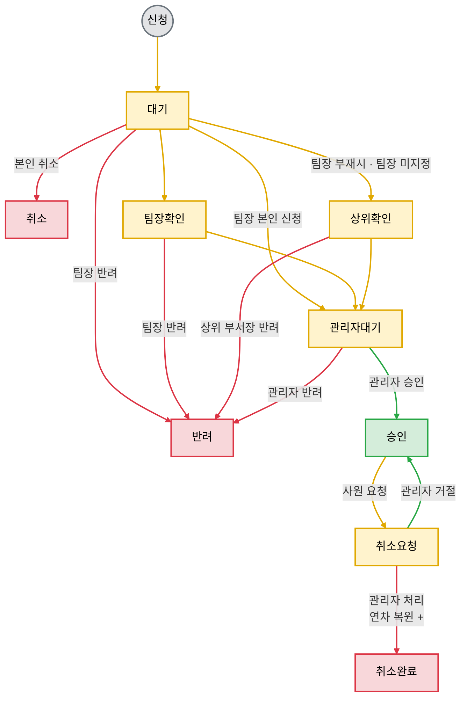
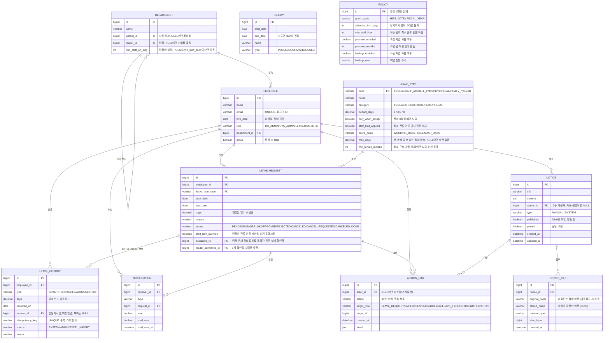

# Notion 설계 원문 — 2026-09-21

조회일: 2026-09-21. 상세 페이지 도구 보고 수정 시각: 2026-09-21T07:22:33.827Z (16:22 KST).

출처: [Leave-System](https://app.notion.com/p/3db2735d9891805fa4e6e0bf4927f054), [휴가관리 시스템 V2 — 설계 문서](https://app.notion.com/p/3de2735d989181df93e7f7670927c0c9).

> 내용 보존용 스냅샷이다. HTML 표를 Markdown 표로 바꾸고 행 끝 공백을 정리했다. 나머지 본문·코드·ERD·미결 목록은 유지했다. 원문의 오타·중복·상충 문구도 남아 있다. 현재 정리 기준과 충돌 설명은 [초기설계-V02](../초기설계-V02.md), [DB설계-V02](../DB설계-V02.md)를 참조한다.

## 상위 페이지 본문

## 사용 스택
**백엔드**
- Java 21
- Spring Boot  4.1.1
- Spring Data JPA + 네이티브 SQL (리포트·부서 재귀 CTE만 SQL)
- Spring Security (세션 방식)
- Spring Mail + Thymeleaf (메일 템플릿)
- Spring @Scheduled + 실행 로그 테이블
- springdoc-openapi (Swagger UI)
- Apache POI → 엑셀 임포트·내보내기
**DB**
- MySQL 8 → 익숙한 문법
- Flyway (flyway-core, flyway-mysql) → 백업용
**프론트엔드**
- React + Vite + TypeScript
- TanStack Query (폴링, 서버 상태 캐시)
**배포**
- Docker Compose (앱 + MySQL, DB 볼륨은 호스트 경로)
**사용 안 함**
- 캐시 (Redis 등), 메시지큐 — 해결할 문제가 없음
- JWT — 서버 한 대라 무상태 이점이 없음. 리프레시 토큰도 결국 DB 저장이라 상태가 생김
- Quartz — 규모 대비 무거움, @Scheduled 대체 가능
<empty-block/>
<page url="https://app.notion.com/p/3de2735d989181df93e7f7670927c0c9">휴가관리 시스템 V2 — 설계 문서</page>
<unknown url="https://app.notion.com/p/3db2735d9891805fa4e6e0bf4927f054#3de2735d98918028a5b6f6543ab5ab4a" alt="external_object_instance"/>
## API 설계
- API 성공
```javascript
{
	"success": true,
	"data": {...}
}
```
- API 실패
```javascript
{
  "success": false,
  "error": {
	  "status": status
    "message": msg
  }
}
```
<empty-block/>

> 상위 페이지의 외부 연결 블록은 이전 별도 조회에서 비어 있었으며 이번에도 동일한 unknown 블록 1개로 반환됐다. 상세 설계는 잘림·미해석 블록 없이 전체 조회했다.

## 상세 설계 본문

작성일: 2026-09-17 · 상태: 초기 설계 (1\~3단계 완료, 4단계 스택 선택 완료)
# 1. 목적
엑셀·메일·슬랙으로 흩어진 연차 신청 과정을 **신청 한 번**으로 끝낸다.
- 신청·승인·반려 시 앱 내 알림과 이메일이 자동 발송된다
- 잔여 연차는 시스템이 자동 계산하고, 계산이 절대 꼬이지 않아야 한다
- 성공 기준: 사원이 엑셀과 메일 없이 신청만 하면 되고, 관리자가 수기 차감을 하지 않는다
# 2. 제약 조건
- 사용자 50명 내외, 사내 내부망 배포
- 내부망이라 보안도 고려 대상이나 지금은 개발에 집중. 인증 방식·외부 통신(SMTP, 공공데이터 API) 허용 여부는 배포 전 인프라 담당자에게 확인
- 혼자 개발, 주변 도움, 기한 없음 → MVP 범위를 먼저 고정
- 기존 엑셀은 1회 임포트 후 시스템이 유일한 원본. 이후 내보내기는 엑셀·PDF·JSON 등 형식 무관
- 슬랙 연동은 이번 범위 밖
- 모든 목록 조회는 20건 페이지네이션. 이벤트로그가 계속 쌓이므로 전체 로드 금지
# 3. 기능 요구사항
### 사원
| ID | 요구사항 |
| --- | --- |
| FR-01 | 회사 사원만 로그인할 수 있다 |
| FR-02 | 연차·반차·병가·공가·경조사를 신청한다 (기간 선택, 사유 입력) |
| FR-03 | 신청 화면 달력에서 공휴일·사내휴일·신청 금지 기간을 확인한다 |
| FR-04 | 대기 중인 본인 신청을 취소한다 |
| FR-05 | 승인된 본인 연차에 취소를 요청한다 |
| FR-06 | 본인 남은 연차와 사용 이력을 조회한다 |
| FR-07 | 본인 신청 중 대기 건수를 안내받는다 |
| FR-08 | 오늘 출근·휴가 중인 팀원과 팀장을 조회한다 |
| FR-09 | 신청 결과(승인·반려)를 앱 알림과 메일로 받는다 |
| FR-10 | 팀장이 확인하지 않으면 상위 부서장에게 수동으로 올린다 |
### 팀장 (사원 기능 포함)
| ID | 요구사항 |
| --- | --- |
| FR-11 | 자기 팀 신청을 조회한다 |
| FR-12 | 자기 팀 신청을 1차 확인하거나 반려한다 |
| FR-13 | 잔류 인원 제한을 초과하는 신청을 판단해 통과시킨다 |
| FR-14 | 팀원 신청 접수를 알림·메일로 받는다 |
| FR-15 | 팀장 부재·미지정 시 상위 부서장이 1차 확인을 대신한다 |
### 관리자 (팀장 기능 포함)
| ID | 요구사항 |
| --- | --- |
| FR-16 | 전체 신청을 조회하고 최종 승인·반려한다 |
| FR-17 | 취소 요청을 처리한다 (승인·거절) |
| FR-18 | 요청 없이도 승인된 연차를 직접 취소한다 |
| FR-19 | 타인의 연차를 대리 등록·삭제한다 (본인에게 메일 발송) |
| FR-20 | 사원을 등록·수정하고 퇴사 시 비활성화한다 |
| FR-21 | 부서를 계층 구조로 관리하고 팀장을 지정한다. 최소 잔류 인원은 인사 관리자가 하한, 팀장이 팀 값을 정한다 |
| FR-22 | 휴가 종류별 차감 일수·노출 조건을 설정한다 |
| FR-23 | 사내휴일과 신청 금지 기간을 등록한다 |
| FR-24 | 정책을 변경한다 (부여 기준, 촉진 개월, 백업 주기) |
| FR-25 | 기존 엑셀을 임포트하고 잔액을 대조한다 |
| FR-26 | 연차 현황을 내보낸다 (부서·사원·기간 필터) |
| FR-27 | 수동 백업을 실행하고 백업본으로 복원한다 (확인 문구 입력) |
| FR-28 | 연차 미사용자에게 촉진 메일을 개별 발송한다 |
| FR-29 | 작업 로그를 조회한다 |
| FR-41 | 공지를 작성하고 파일(PDF 등)을 첨부한다. 사원은 공지를 보고 첨부파일을 내려받는다 |
| FR-42 | 휴가 날짜가 지났는데 아직 처리되지 않은 신청을 모아서 본다 |
### 시스템 (자동)
| ID | 요구사항 |
| --- | --- |
| FR-30 | 입사일 기준으로 연차를 자동 부여한다 (1년 미만 월 1일, 이후 15일 + 가산) |
| FR-31 | 기산일에 미사용 연차를 소멸시킨다 |
| FR-32 | 신청 일수를 계산한다 (주말·공휴일 제외, 반차 0.5) |
| FR-33 | 신청 금지 기간이거나, 본인의 기존 신청(대기·팀장확인·승인·취소요청 중)과 날짜가 겹치면 신청을 거부한다 |
| FR-34 | 신청·승인 시 잔여 + 당겨쓰기 한도를 초과하면 거부한다 (승인 시 재검증) |
| FR-35 | 잔류 인원 제한을 검증한다 (팀장 통과 플래그 없으면 거부) |
| FR-36 | 상태 변화 시 알림을 생성하고 메일을 발송한다 |
| FR-37 | 모든 행위를 작업 로그에 기록한다 |
| FR-38 | 설정된 개월 전에 촉진 메일을 자동 발송한다 |
| FR-39 | 공휴일을 공공데이터포털 API로 동기화한다 |
| FR-40 | 설정된 주기로 DB를 백업한다 |
### 비기능 요구사항
| ID | 요구사항 |
| --- | --- |
| NFR-01 | 연차 계산이 어느 상황에서도 어긋나지 않는다 (동시 승인, 중복 차감 방지) |
| NFR-02 | 모든 목록 조회는 20건 페이지네이션 |
| NFR-03 | 사내 내부망에서 동작한다 |
| NFR-04 | 권한별 조회 범위를 서버에서 강제한다 |
| NFR-05 | DB 손실 시 백업으로 복구 가능하다 |
# 4. 핵심 데이터
잔여 연차는 컬럼에 저장하지 않고 연차 이력 합계로 계산한다. 이력이 남아 어느 시점의 잔액도 재계산할 수 있고, 틀렸을 때 원인 추적이 된다.
| 테이블 | 컬럼 | 비고 |
| --- | --- | --- |
| 사원 | 이름, 이메일(UNIQUE, 로그인 ID), 부서, 입사일, 역할, 재직 여부 | 사번 필드 없음(미사용) |
| 부서 | 이름, 상위 부서(self-reference), 팀장, 최소 잔류 인원 | 연구소 → 1팀 → 1-1팀, 깊이 제한 없음. 하위 조회는 MySQL 8 재귀 CTE |
| 휴가종류 | 코드, 분류, 차감 일수(1 / 0.5 / 0), 노출 조건, 잔류 규칙 적용, 계산 기준(근무일/달력일), 일수, 최소 근속 | 결재선은 모든 종류가 동일해 컬럼 없음. 병가·공가는 잔여 0일일 때만 노출 |
| 연차 이력 | 사원, 종류(부여/사용/취소/정정/소멸), 일수(±), 발생일, 참조 신청, 출처 | DECIMAL(4,1). 잔여 = SUM(일수). 날짜당 한 행. 인덱스 (사원, 발생일) |
| 연차 신청 | 신청자, 휴가종류, 시작일, 종료일, 계산된 일수(스냅샷), 사유, 상태 | 현재 상태를 담는 업무 테이블. 로그와 분리 |
| 이벤트 로그 | 행위자, 행위, 대상, 시각, 상세(JSON) | append-only. 모든 행위 기록. 승인 이력은 여기로 흡수 |
| 알림 | 수신자, 종류, 참조 신청, 읽음 여부, 메일 발송 여부·시각 | 로그는 "일어난 일", 알림은 "이 사람에게 보여줄 것" |
| 휴일 | 날짜(또는 기간), 이름, 종류(공휴일 / 사내휴일 / 신청금지) | 공휴일은 공공데이터포털 API 동기화, 사내휴일·금지 기간은 관리자 등록. 금지 기간은 신청 검증에서 막고 달력에 표시 |
| 정책(설정) | 부여기준, 당겨쓰기 한도, 잔류 인원 하한, 촉진 개월, 백업 주기 | 연차 정책은 인사 관리자, 운영 정책은 시스템 관리자 |
# 5. 신청·승인 흐름
연차 이력에 사용(−) 행이 생기는 곳은 **인사 관리자 승인 시점 한 곳**뿐이다.

노랑 = 결정 전 상태, 초록 = 승인, 빨강 = 반려·취소. 색 박스는 상태·단계, 화살표 라벨은 그 경로를 타는 조건이다.
1차 확인자는 세 가지로 갈린다: 정상이면 팀장, 팀장이 그날 연차·반차 승인 상태거나 부서에 팀장이 지정되지 않았으면 상위 부서장, 팀장 본인 신청이면 1차 확인 없이 인사 관리자에게 바로 간다. 인사 관리자 승인은 예외 없이 모두가 거친다.
DB 상태값은 `팀장확인`과 `상위확인`을 나누지 않고 `LEADER_OK` 하나로 두며, 누가 확인했는지는 `escalated_to`로 구분한다.
## 테이블 관계도 (ERD)
남은 연차는 `LEAVE_HISTORY`의 `days` 합계로 계산한다. 잔액 컬럼은 어느 테이블에도 없다.

- `LEAVE_HISTORY`가 시스템의 중심. 남은 연차 = `SUM(days)`
- 중복 기록은 `idempotency_key` UNIQUE로 막는다 (아래 정합성 불변식 참조). 기존 `UNIQUE(request_id, type)`은 삭제 — request_id가 NULL인 부여·소멸을 못 막고, ADJUST 재정정까지 막았다
- `HOLIDAY`는 기간으로 두어 "1월 2일\~3일 신년회 신청 금지"를 한 행으로 처리
- `EMPLOYEE.active` — 퇴사자는 삭제하지 않고 비활성화. 과거 이력이 남아야 하기 때문
- 반차까지 0.5 단위로 확정. 시간 단위 휴가는 사용 안 함
- 대기 중 신청은 남은 연차에서 빼지 않고 "신청 N건 대기중" 안내만 표시. 초과 여부는 승인 시점에 서버가 검증
- `POLICY`는 키-값이 아니라 컬럼 방식. 회사 설정 한 벌이라 항상 1행이고, 설정마다 제 타입을 갖는다. 설정 추가 시 Flyway로 컬럼을 늘리며, 기존 행이 있으므로 `NOT NULL DEFAULT`를 반드시 붙인다
- `POLICY`와 `HOLIDAY`는 특정 사원·신청에 속하지 않아 외래키 연결이 없다. 코드가 필요할 때 조회해 쓴다
### 결재선 — 고정 (정책 스위치 없음)
`사원 신청 → 팀장 확인 → 인사 관리자 승인`을 모든 휴가 종류에 동일하게 적용한다. 휴가종류별 결재선 설정과 팀장단계 on/off 정책을 둘 다 없앤다 — 스위치를 두면 팀장이 자기 단계를 뺄 수 있고, 잔류 인원 제한 초과 건을 누가 판단할지가 애매해진다.
상위 부서장에게 올라가는 경우:
1. 팀장이 그날 연차·반차 승인 상태 (시스템 자동 판단)
2. 부서에 팀장이 지정되지 않음(`leader_id` null)
팀장 본인 신청은 상위 부서장을 거치지 않고 1차 확인 없이 인사 관리자에게 바로 간다. 자기가 자기 것을 확인할 수 없기 때문이고, 조직 규모상 상위 부서장을 한 번 더 거칠 실익이 없다.
외근은 부재로 치지 않는다. 외근 중에도 폰으로 승인할 수 있어 외근을 휴가 종류로 만들 이유가 없다. 대신 팀장이 계속 확인하지 않으면 사원이나 관리자가 "위로 올리기"로 수동 에스컬레이션한다.
### 최소 잔류 인원 제한
팀마다 `min_staff_on_duty`를 두어 "최소 N명은 남아 업무를 본다"를 강제한다.
- 적용 대상: 연차·경조사. 반차·병가·공가는 제외(`staff_limit_applied`)
- 세는 대상: 화면 경고는 승인 + 대기 중(`휴가 2명 + 대기 1명`), 승인 차단은 승인된 휴가만 (정합성 불변식 4)
- 기준: 최대 동시 휴가 인원이 아니라 최소 잔류 인원. 팀원 수가 변해도 규칙이 그대로 유효하다
- 모수: 활성 사원 수. 장기 부재자 제외 여부는 질문사항
- 직속 부서만 센다. 1-1팀 사원의 휴가는 1-1팀만 검사한다
- 신청은 막지 않고 경고만 표시. 팀장이 판단해 통과시키면 `staff_limit_override` 플래그가 붙고, 인사 관리자는 플래그가 있는 건만 초과 승인할 수 있다
검증은 승인 트랜잭션 안에서 부서 행을 잠그고 신청 기간의 근무일마다 반복한다. `(활성 팀원 수 − 승인된 휴가 인원 − 1) < max(floor, min_staff_on_duty)`이면 거부.
**취소·대리 처리**
- 대기 중 신청은 본인이 취소한다. 승인된 신청은 취소요청 → 인사 관리자 처리
- 인사 관리자는 요청 없이 직접 취소·대리 등록·삭제할 수 있다. 해당 사원에게 알림·메일
- 모든 상태 변화는 이벤트로그에 기록, 알림은 커밋 후 비동기 발송
### 정합성 불변식
NFR-01을 지키기 위해 코드가 반드시 지켜야 하는 규칙이다. 검사를 코드에만 두면 조회와 저장 사이에 다른 실행이 끼어들 틈이 생긴다. DB 제약은 그 틈이 없다.
**1. 멱등성 키 — 같은 일을 두 번 기록하지 못하게**
`leave_history.idempotency_key`에 UNIQUE. 배치가 두 번 돌거나 승인 처리가 재시도돼도 두 번째는 DB가 거부한다.
| type | 키 형식 | 예 |
| --- | --- | --- |
| GRANT | GRANT:\{사원id\}:\{기산일\} | GRANT:7:2026-03-15 |
| EXPIRE | EXPIRE:\{사원id\}:\{기산일\} | EXPIRE:7:2027-03-14 |
| USE | USE:\{신청id\}:\{날짜\} | USE:42:2026-09-21 |
| CANCEL | CANCEL:\{신청id\}:\{날짜\} | CANCEL:42:2026-09-21 |
| ADJUST | ADJUST:\{UUID\} | ADJUST:a3f9c1 — 재정정 가능해야 하므로 매번 다름 |
| 임포트 | IMPORT:\{배치id\}:\{행번호\} | IMPORT\:b1\:0031 |
**2. 락 순서 — 부서 → 사원**
승인 트랜잭션은 반드시 이 순서를 지킨다. 반대로 잠그는 코드가 하나라도 있으면 데드락이다.
```javascript
1. SELECT * FROM department WHERE id=? FOR UPDATE
2. 잔류 인원 검증
3. SELECT * FROM employee   WHERE id=? FOR UPDATE
4. SELECT SUM(days) FROM leave_history WHERE employee_id=?
5. 잔여 >= 신청일수 검증
6. UPDATE leave_request SET status='APPROVED' WHERE id=? AND status='LEADER_OK'
7. INSERT INTO leave_history — 휴가 날짜마다 한 행 (idempotency_key='USE:42:2026-09-21' ...)
```
잔여 SUM은 반드시 3번 락 이후에 읽는다. 락 없이 읽으면 관리자 둘이 동시에 "잔여 충분"을 보고 둘 다 통과시킨다.
**3. 소멸 이후 취소 — 취소 자체를 막는다**
이미 소멸된 기간의 휴가는 취소할 수 없다. 허용하면 CANCEL(+) 행이 사라졌어야 할 연차를 부활시킨다.
```javascript
GRANT   +16.0   2026-03-15    → 16.0
USE      -3.0   2026-05-10    → 13.0
EXPIRE  -13.0   2027-03-14    →  0.0   소멸 완료
CANCEL   +3.0   2027-04-01    →  3.0   ← 이미 없어졌어야 할 3일이 부활
```
검증: 취소 요청 시 해당 신청의 `occurred_on`이 속한 기간에 EXPIRE 행이 있으면 400으로 거부한다 — "이미 소멸된 기간의 휴가는 취소할 수 없습니다". 예외가 필요하면 관리자가 ADJUST 행으로 명시적으로 부여한다. 자동 복원을 하지 않는 이유는 "왜 연차가 다시 생겼는지"가 기록으로 남아야 하기 때문이다.
**4. 잔류 인원 — 경고와 차단의 모수가 다르다**
- 화면 경고: `status IN ('PENDING','LEADER_OK','APPROVED')` — 사원에게 "휴가 2명 + 대기 1명"을 보여준다
- 승인 차단: `status = 'APPROVED'`만 센다 — 대기 건은 반려될 수 있어 승인을 막으면 안 된다
**5. 부서 계층 사이클 방지**
부서 저장 시 `parent_id`를 따라 올라가며 자기 id가 나오면 거부한다. 재귀 CTE에도 `depth < 10` 제한을 둔다. 사이클이 생기면 하위 부서 조회가 무한루프에 빠진다.
### 기간 구분과 당겨쓰기
기산일은 사람마다 다르므로(입사일 기준) 기간을 그때그때 계산해 날짜 범위로 조회한다. 기간 구분용 컬럼은 두지 않는다.
```sql
-- 2024-03-15 입사자의 2026년도 잔여
SELECT COALESCE(SUM(days), 0) FROM leave_history
WHERE employee_id = ?
  AND occurred_on >= '2026-03-15' AND occurred_on < '2027-03-15'
```
**미래일 신청** — 다음 기간 날짜로 미리 신청하는 경우. `occurred_on`이 다음 기간이라 날짜 범위가 알아서 갈라준다. 별도 처리가 필요 없다.
```javascript
GRANT   +16.0   2026-03-15    2026 기간
USE      -3.0   2026-05-10    2026 기간
USE      -2.0   2027-05-20    2027 기간   ← 미래일 신청
EXPIRE  -13.0   2027-03-14    2026 기간   ← 2026만 소멸
GRANT   +17.0   2027-03-15    2027 기간

2026 기간 = 0,  2027 기간 = -2 + 17 = 15
```
**당겨쓰기** — `POLICY.advance_limit_days`만큼 잔여가 음수로 갈 수 있다. 0이면 불허. 승인 검증식은 `잔여 + 한도 >= 신청일수`.
기산일에 잔여가 음수면 소멸 대신 **정정 행 두 개**로 다음 기간에 넘긴다. 그냥 두면 기간별 잔여와 전체 잔여가 달라 혼란스럽다.
```javascript
GRANT   +16.0   2026-03-15    2026 기간   16.0
USE     -16.0   (여러 건)     2026 기간    0.0
USE      -2.0   2027-01-20    2026 기간   -2.0   ← 당겨쓰기

ADJUST   +2.0   2027-03-14    2026 기간    0.0   ← 이전 기간 마감
GRANT   +17.0   2027-03-15    2027 기간   17.0
ADJUST   -2.0   2027-03-15    2027 기간   15.0   ← 새 기간에서 회수
```
기간별로 보나 전체로 보나 15로 일치한다.
# 6. 권한
| 역할 | 범위 |
| --- | --- |
| 인사 관리자 | 전부. 시스템 관리자 권한 + 연차 이력을 바꾸는 모든 것(최종 승인·반려, 취소요청 처리, 직접 취소, 정정, 대리 등록·삭제, 엑셀 임포트) + 연차 정책·휴가종류 + 인사 관리자 역할 부여 |
| 시스템 관리자 | 인사 관련 빼고 전부. 계정·부서·휴일, 운영 정책(백업), 백업·복원, 리포트, 로그 조회 |
| 팀장 | 자기 팀 신청 1차 확인·반려, 잔류 인원 제한 초과 건 판단, 본인 신청, 오늘 출근·휴가 인원 |
| 사원 | 본인 신청·취소·취소요청, 본인 잔여, 팀원·팀장의 오늘 출근·휴가 인원 |
팀장의 "자기 팀만"은 별도 API가 아니라 같은 조회 API에서 서버가 `WHERE 부서 = 내 부서` 조건을 강제로 붙인다. 프론트 필터링은 URL 조작으로 뚫린다.
### 인사 관리자와 시스템 관리자 분리
**기준: 잔여 연차가 차감되거나 추가되는 모든 일은 인사 관리자의 손을 거친다.** 인사 관리자 ⊃ 시스템 관리자 구조로, 시스템 관리자는 인사에 관여하지 못한다.
| 권한 | 인사 관리자 | 시스템 관리자 |
| --- | --- | --- |
| 최종 승인·반려, 취소요청 처리, 직접 취소 | ✓ |  |
| 연차 정정(ADJUST), 대리 등록·삭제, 엑셀 임포트 | ✓ |  |
| 연차 정책(grant_basis, advance_limit_days, promote_months, min_staff_floor) | ✓ |  |
| 휴가종류 설정(차감 일수, 경조사 정책 등) | ✓ |  |
| 인사 관리자 역할 부여 | ✓ |  |
| 계정·부서·휴일 | ✓ | ✓ |
| 운영 정책(backup_enabled, backup_cron) | ✓ | ✓ |
| 백업·복원, 로그, 리포트 | ✓ | ✓ |
- 연차 정책과 휴가종류를 인사 쪽에 둔 이유: 당겨쓰기 한도나 병가 차감 일수를 바꾸면 결국 잔여가 바뀐다. 시스템 관리자가 바꾸면 인사가 모르는 사이 연차 규칙이 바뀐다
- 인사 관리자 역할 부여를 인사 쪽에 둔 이유: 시스템 관리자가 계정·권한을 관리하므로, 막지 않으면 자기 자신에게 인사 관리자를 주어 분리가 무너진다
- 예외: 스케줄러가 하는 자동 부여(GRANT)·소멸(EXPIRE)은 사람이 아니라 시스템이 한다. 규칙은 "사람이 손으로 잔여를 바꾸는 것은 인사 관리자만"
- 구현: `leave_history` INSERT를 서비스 한 곳으로 모으고 사람이 호출하는 경로에 `@PreAuthorize("hasRole('HR')")`를 건다. 규칙이 코드로 강제된다
- 인사 ⊃ 시스템이므로 한 사람이 둘을 겸할 때도 인사 관리자 하나만 주면 된다. `role` 단일 컬럼으로 충분하다
**인사 관리자 본인 신청** — 1차 확인 없이 본인이 최종 승인·반려한다. 담당자가 한 명인 규모라 별도 승인자를 둘 수 없다. 잔여·금지 기간·잔류 인원 검증은 동일하게 적용하고, 이벤트로그에 본인 승인임을 구분해 남긴다(`detail`에 `"self": true`). 감사 요청 시 근거가 된다.
**팀장 확인 여부** — 별도 컬럼 없이 `status`로 표현한다. `PENDING`은 팀장 화면에만, `LEADER_OK`부터 인사 관리자 화면에 올라간다. 결재선은 고정이므로 팀별 on/off 스위치는 두지 않는다.
**최소 잔류 인원 설정 — 하한은 인사, 그 이상은 팀장**
- 인사 관리자가 `POLICY.min_staff_floor`로 회사 전체 하한을 정한다 (예: 어떤 팀이든 1명 이상)
- 팀장은 자기 팀 `DEPARTMENT.min_staff_on_duty`를 하한 이상으로만 설정한다. 저장 시 서버가 `값 >= floor`를 검증
- 실제 적용값 = `max(floor, 팀 설정값)`. 인사가 나중에 floor를 올리면 자동 적용된다
- 팀장이 전부 정하면 자기 팀 제한을 0으로 풀 수 있고, 인사가 전부 정하면 3명 팀과 15명 팀에 같은 숫자가 강제된다. 하한만 인사가 쥐는 방식으로 두 문제를 모두 피한다
**팀장 부재 기준** — 업무를 처리할 수 없는 상태. 외근·재택은 부재가 아니다.
- 승인된 휴가(연차·반차·병가·공가·경조사) → 시스템이 자동 판단해 상위 부서장에게
- 출장·교육·급한 결근 등 → 시스템이 알 수 없으므로 사원 또는 관리자가 수동으로 위로 올림
- 외근·재택 → 부재 아님. 팀장이 그대로 처리
**병가·공가 승인 권한** — 현재는 다른 휴가와 같이 팀장 확인 → 인사 승인. 무급 여부가 확정되지 않아 인사를 빼지 않는다. 팀장 승인으로 끝낼지는 질문사항으로 확인 후 결정한다.
## 공지사항
관리자가 공지를 올리고, 정책이 바뀌면 시스템이 공지를 자동 생성한다. 알림만 보내면 읽고 나서 다시 확인할 방법이 없으므로 발송 경로를 공지 한 곳으로 모은다.
- `type` — MANUAL(관리자 작성) / SYSTEM(정책 변경 자동 생성). 정책을 몇 번 만지면 목록이 시스템 공지로 차므로 화면에서 구분한다
- `published` — 자동 생성 시 false(초안). 관리자가 내용을 확인·수정하고 "저장 후 발송"을 누르면 true가 되며 그때 알림이 나간다. 사원 화면은 published=true만 조회
- 초안 방식을 택한 이유: 정책을 잘못 저장해도 전 직원에게 바로 나가지 않고, 기계적인 자동 문구를 다듬을 수 있다. 대신 관리자가 초안을 잊으면 정책만 조용히 바뀌므로 관리자 화면에 "미발송 공지 N건" 표시가 필요하다
- 발송 시 서버가 `published`를 먼저 검사한다. 버튼 중복 클릭으로 알림이 두 번 나가는 것을 막는다
- 알림 발송은 공지 저장과 같은 트랜잭션에 넣지 않는다. 알림 행 INSERT까지만 트랜잭션, 실제 메일은 커밋 후 비동기
- 이미 발송된 공지를 수정해도 알림은 재발송하지 않는다
- **첨부파일** — 공지에 PDF 등을 붙이고 사원이 내려받는다(예: "2027년 휴일 안내" PDF). `NOTICE_FILE` 테이블에 원본 이름과 저장 이름을 따로 두고, 파일은 서버 디스크(Docker 볼륨)에, DB에는 경로만 둔다. 내부망 서버 한 대라 오브젝트 스토리지는 필요 없다. 저장 폴더도 백업 대상에 넣는다(mysqldump는 DB만 백업한다)
	- 다운로드는 로그인한 사원만, API를 거쳐서 준다. 파일 경로를 직접 열어주지 않는다
	- 업로드 제한: 허용 확장자(PDF, 이미지, 오피스 문서), 파일 크기, 저장 이름은 UUID로 바꿔 경로 조작을 막는다
`POLICY`는 컬럼 방식이라 "이 설정이 바뀌면 공지한다"는 플래그를 행마다 둘 수 없다. 대신 공지 대상 필드와 사원에게 보여줄 이름을 코드에 매핑으로 둔다.
- `grant_basis` → "연차 부여 기준" · 공지함
- `promote_months` → "연차 사용 촉진 안내 시점" · 공지함
- `backup_cron`, `backup_enabled` → 운영 설정이라 공지 안 함
before/after 값은 이벤트로그 `detail`에 이미 담기므로 공지 문구를 만들 때 그대로 쓴다. 필드명을 그대로 쓰면 사원이 알아볼 수 없어 표시용 이름이 필요하다.
## 이벤트로그에 기록하는 행위
시스템 안에서 일어나는 이벤트만 남긴다. 로그인·로그아웃은 제외(전체 행의 2/3를 차지하는데 용도가 정의되지 않았다. 사내 보안 감사 요구사항이 확인되면 재검토). 배치는 성공을 매일 쌓을 이유가 없어 실패만 남긴다.
| 구분 | action | 행위자 |
| --- | --- | --- |
| 신청 | APPLY / PROXY_APPLY / LEADER_CONFIRM / APPROVE / REJECT / SELF_CANCEL / CANCEL_REQUEST / CANCEL_APPROVE / CANCEL_REJECT | 해당 행위자 |
| 연차 변동 | GRANT / EXPIRE | NULL (스케줄러) |
| 연차 변동 | ADJUST / EXCEL_IMPORT | 관리자 |
| 사원 관리 | EMPLOYEE_CREATE / EMPLOYEE_UPDATE / EMPLOYEE_DEACTIVATE / DEPARTMENT_CHANGE / ROLE_CHANGE | 관리자 |
| 설정 | POLICY_CHANGE / HOLIDAY_ADD / HOLIDAY_DELETE / LEAVE_TYPE_CHANGE | 관리자 |
| 공지 | NOTICE_CREATE / NOTICE_UPDATE / NOTICE_DELETE | 관리자 (자동 생성은 정책을 바꾼 관리자) |
| 알림 | NOTIFY_SENT / MAIL_SENT / MAIL_FAILED | NULL (시스템) |
| 알림 | NOTIFY_READ | 사원 |
| 배치 | BATCH_FAILED | NULL (시스템) |
총 30종. 연 5\~7천 행 수준이라 보관은 부담이 없다.
- `PROXY_APPLY`를 따로 둔 이유 — 신청 테이블만 보면 본인이 냈는지 관리자가 대신 냈는지 구분되지 않는다
- `ROLE_CHANGE`를 `EMPLOYEE_UPDATE`와 분리한 이유 — 권한 변경만 따로 뽑아볼 수 있어야 한다
- `DEPARTMENT_CHANGE`의 `detail`에는 부서 ID와 이름을 함께 남긴다. 부서가 나중에 개명·삭제되면 ID만으로는 복원할 수 없다
- `GRANT`·`EXPIRE`는 배치 단위가 아니라 사원당 1행. 문의가 개인 단위로 오기 때문이다. 50명 기준 연 100행
- 알림 3종을 `NOTIFICATION` 테이블과 중복해서 남기는 이유 — 알림 테이블은 현재 상태(읽음·발송 여부)라 재발송하면 첫 발송 시각이 덮어써진다. 로그엔 모든 시각이 남는다
- 로그는 본 작업과 같은 트랜잭션에 넣는다. `REQUIRES_NEW`를 쓰면 롤백된 승인의 로그만 남아 "승인 기록은 있는데 승인이 안 된" 상태가 된다
- enum + `@Enumerated(STRING)`. `ORDINAL`은 enum 순서가 바뀌면 과거 데이터가 전부 틀어진다
- 조회 인덱스: `(target_type, target_id, created_at)`, `(actor_id, created_at)`, `(created_at)`
- `detail` JSON 내부 전문 검색 기능은 넣지 않는다. MySQL JSON 검색은 인덱스를 못 탄다. 자주 찾는 값이 생기면 그때 컬럼으로 승격한다
# 7. 화면 구성
메뉴는 역할에 따라 상속된다. 사원 ⊂ 팀장 ⊂ 시스템 관리자 ⊂ 인사 관리자.
**사원**
| 메뉴 | 내용 |
| --- | --- |
| 대시보드 | 남은 연차, 대기 N건, 알림, 공지, 연차 신청 |
| 캘린더 | 회사 전체 월 단위 휴가 현황, 휴일·신청 금지 기간, 연차 신청, 부서 필터 |
| 팀 현황 | 오늘 출근·휴가 인원 |
| 개인정보 | 내 정보, 내 신청 내역·연차 이력 |
**팀장 (+)**
| 메뉴 | 내용 |
| --- | --- |
| 팀 관리 | 팀원 신청 1차 확인·반려, 잔류 인원 경고 |
| 팀 설정 | 최소 잔류 인원 (하한 이상) |
**시스템 관리자 (+)** — 사원·계정, 부서, 휴일, 공지(첨부파일), 운영 정책(백업), 백업·복원, 로그, 리포트
**인사 관리자 (+)** — 최종 승인·반려, 취소요청 처리, 연차 정정·대리 등록, 연차 정책·휴가종류, 엑셀 임포트, **날짜 지난 미처리 신청 N건**
날짜 지난 미처리 신청은 시스템이 자동으로 처리하지 않는다. 실제로 쉰으면 인사가 승인(또는 대리 등록)하고, 출근했으면 취소한다. 시스템은 인사가 놓치지 않게 목록으로 보여주기만 한다.
### 캘린더 표시 규칙
- 범위: 회사 전체. 인원이 많은 날을 위해 부서 필터
- 표시: `이름 + 종류`만 (연차 / 반차(오전·오후) / 병가 / 공가 / 경조사). 사유는 표시하지 않는다
- 캘린더 API 응답에 **사유 필드를 넣지 않는다**. 프론트에서 숨기면 응답에 사유가 그대로 담겨 간다. 사유는 본인 신청 상세·팀장 확인·인사 화면에서만 별도 조회
- 병가·공가 종류를 다른 사원에게도 그대로 보여줄지는 15번 질문사항 참고
## API 설계
**원칙**
- 행위를 URL에: `POST /leave-requests/{id}/approve` — 상태 전이가 많아 무슨 일이 일어나는지 URL에 드러나게 한다
- 역할별 경로 분리: `/api/team/**`, `/api/hr/**`, `/api/admin/**` — Security 설정에서 경로 단위로 권한을 건다. 인사 관리자는 `/api/admin/**`도 접근 가능
- 공통 응답: 성공 `{ "success": true, "data": ... }`, 실패 `{ "success": false, "error": { "status": 400, "message": "..." } }`. HTTP 상태 코드도 의미대로 쓴다
- 예외는 `BusinessException`(RuntimeException 상속)을 던지고 `@RestControllerAdvice`에서 공통 응답으로 변환한다
- 목록은 20건 페이지네이션
**인증**
| 메서드 | 경로 | 설명 |
| --- | --- | --- |
| POST | /api/auth/login | 아이디·비번 로그인 (dev 프로필 전용) |
| POST | /api/auth/logout | 로그아웃 |
| GET | /api/auth/me | 내 정보·역할 |
| GET | /oauth2/authorization/google | Google 로그인 시작 (prod, Spring Security 제공) |
**사원**
| 메서드 | 경로 | 설명 | FR |
| --- | --- | --- | --- |
| GET | /api/me/summary | 남은 연차, 대기 N건 | 06·07 |
| GET | /api/me/leave-requests | 내 신청 내역 | 06 |
| GET | /api/me/leave-history | 내 연차 이력 | 06 |
| GET | /api/leave-types | 신청 가능 종류 (서버가 노출 조건 반영) | 02 |
| POST | /api/leave-requests/preview | 일수 계산·잔류 경고 미리보기 (저장 안 함) | 32·35 |
| POST | /api/leave-requests | 신청 | 02 |
| POST | /api/leave-requests/\{id\}/cancel | 대기 중 취소 | 04 |
| POST | /api/leave-requests/\{id\}/cancel-request | 승인 후 취소요청 | 05 |
| POST | /api/leave-requests/\{id\}/escalate | 상위로 올리기 | 10 |
| GET | /api/calendar | 회사 전체 휴가 (이름+종류만) | — |
| GET | /api/holidays | 휴일·금지 기간 | 03 |
| GET | /api/team/today | 팀 현황 | 08 |
| GET | /api/notifications | 알림 목록 | 09 |
| PATCH | /api/notifications/\{id\}/read | 읽음 처리 | 09 |
| GET | /api/notices | 공지 목록·상세 (published만) | 41 |
| GET | /api/notices/\{id\}/files/\{fileId\} | 첨부파일 다운로드 | 41 |
**팀장** `/api/team/**`
| 메서드 | 경로 | 설명 | FR |
| --- | --- | --- | --- |
| GET | /api/team/leave-requests | 팀 신청 (승인 대기) | 11 |
| POST | /api/team/leave-requests/\{id\}/confirm | 1차 확인 (잔류 초과 통과 여부 포함) | 12·13 |
| POST | /api/team/leave-requests/\{id\}/reject | 반려 | 12 |
| PATCH | /api/team/settings | 최소 잔류 인원 | — |
**인사 관리자** `/api/hr/**`
| 메서드 | 경로 | 설명 | FR |
| --- | --- | --- | --- |
| GET | /api/hr/leave-requests | 전체 신청 (최종 승인 대기) | 16 |
| POST | /api/hr/leave-requests/\{id\}/approve | 최종 승인 | 16 |
| POST | /api/hr/leave-requests/\{id\}/reject | 최종 반려 | 16 |
| POST | /api/hr/leave-requests/\{id\}/cancel | 직접 취소·취소요청 승인 | 17·18 |
| POST | /api/hr/leave-requests/\{id\}/cancel-reject | 취소요청 거절 | 17 |
| POST | /api/hr/leave-requests | 대리 등록 | 19 |
| POST | /api/hr/adjustments | 연차 정정 | — |
| PUT | /api/hr/policy | 연차 정책 | 24 |
| CRUD | /api/hr/leave-types | 휴가종류·경조사 정책 | 22 |
| POST | /api/hr/imports | 엑셀 임포트 + 대조 결과 | 25 |
| POST | /api/hr/promotions | 촉진 메일 개별 발송 | 28 |
**시스템 관리자** `/api/admin/**` (인사 관리자도 접근 가능)
| 메서드 | 경로 | 설명 | FR |
| --- | --- | --- | --- |
| CRUD | /api/admin/employees | 사원·계정 | 20 |
| CRUD | /api/admin/departments | 부서 | 21 |
| CRUD | /api/admin/holidays | 휴일 등록 | 23 |
| POST | /api/admin/holidays/sync | 공휴일 API 동기화 | 39 |
| PUT | /api/admin/policy | 운영 정책(백업) | — |
| POST·GET | /api/admin/backups | 백업 실행·목록. 복원은 POST /api/admin/backups/\{id\}/restore (확인 문구 필수) | 27 |
| GET | /api/admin/logs | 작업 로그 | 29 |
| CRUD | /api/admin/notices | 공지 (첨부파일 업로드 포함) | 41 |
| GET | /api/reports/export | 리포트 다운로드 | 26 |
**구현 시 주의**
- IDOR: `/api/leave-requests/{id}/*`는 서비스에서 "신청자 = 로그인한 사람"을, `/api/team/**`은 "신청자가 내 팀"을 반드시 확인한다
- 정책 경로가 두 개인 이유: 같은 `POLICY` 테이블이지만 연차 정책은 인사, 운영 정책은 시스템 관리자 권한
- `preview`는 사원이 날짜를 고를 때 "3일 차감, 그날 팀에 1명 남음"을 신청 전에 보여주기 위한 계산 전용 API
### 핵심 API 상세
**POST /api/leave-requests/preview** — 저장 없이 계산·검사만
```json
// 요청
{
  "leaveTypeCode": "ANNUAL",      // 휴가 종류
  "startDate": "2026-09-21",      // 시작일
  "endDate": "2026-09-25"         // 종료일 (경조사는 받지 않고 서버가 계산)
}

// 응답 200
{
  "success": true,
  "data": {
    "days": 3.0,                  // 실제 차감될 일수
    "dates": ["2026-09-21", "2026-09-23", "2026-09-25"],   // 연차가 쓰이는 날
    "excludedDates": [             // 기간 안이지만 차감 안 되는 날
      { "date": "2026-09-22", "reason": "추석" }
    ],
    "balance": {
      "current": 13.5,            // 지금 남은 연차
      "after": 10.5,              // 승인되면 남을 연차
      "advanceLimit": 1.0,        // 당겨쓰기 한도
      "pendingCount": 1           // 대기 중인 내 신청 건수
    },
    "staffCheck": [               // 날짜별 팀 잔류 인원 (잔류 규칙 적용 휴가만)
      { "date": "2026-09-23", "teamSize": 5, "onLeave": 2, "pending": 1,
        "remaining": 1, "min": 2, "exceeded": true }
    ],
    "errors": [],                 // 신청 불가 사유 (있으면 신청 버튼 비활성)
    "warnings": ["9/23 팀 잔류 인원이 최소 인원(2명)보다 적습니다."]
  }
}
```
- `remaining = teamSize - onLeave - pending - 1(본인)`. `pending`은 다른 사람의 대기 건
- errors가 있어도 200. 검사 결과를 돌려주는 것이지 요청 실패가 아니다
- errors: 금지 기간, 반차인데 여러 날, 내 기존 신청(대기·팀장확인·승인·취소요청 중)과 겹침, 잔여 + 당겨쓰기 한도 부족, 기산일 걸침, 근속 미달 / warnings: 잔류 인원 초과, 당겨쓰기 사용
- 잔여 부족은 신청 단계에서도 막는다. 단, 대기 중 신청은 잔여에서 빼지 않으므로 여러 건이 같이 대기하면 합이 초과할 수 있고, 그건 승인 시 재검증에서 걸러진다
- 실제 신청(POST)도 같은 계산 서비스를 다시 호출한다. preview는 화면용, 진짜 검증은 저장 시점
**POST /api/leave-requests** — 신청
```json
// 요청: preview 요청 + "reason": "가족 여행"

// 응답 201
{
  "success": true,
  "data": {
    "id": 42,
    "status": "PENDING",
    "days": 3.0,                  // 스냅샷으로 저장된 일수
    "approver": { "id": 7, "name": "김팀장 (연구1팀)" },   // 1차 확인자
    "escalated": false,           // 상위로 갔는지
    "warnings": ["..."]
  }
}
```
흐름: 같은 계산으로 재검증(errors 있으면 400) → 결재자 결정(팀장·인사 본인 신청은 LEADER_OK, 팀장 부재·미지정은 상위 + escalated_to) → 저장 → 로그 → 커밋 후 알림. 화면에서 이미 preview로 막기 때문에 400은 마지막 방어선이다(그 사이 금지 기간이 추가됐거나 API를 직접 호출한 경우).
**POST /api/team/leave-requests/\{id\}/confirm** — 팀장 1차 확인
```json
// 요청
{
  "staffLimitOverride": true,     // 잔류 초과를 알고 통과시키는가 (초과 건일 때만)
  "comment": "대체 인력 확인함"    // 메모 (선택)
}

// 응답 200
{ "success": true, "data": { "id": 42, "status": "LEADER_OK", "staffLimitOverride": true } }
```
| 실패 상황 | 코드 |
| --- | --- |
| 내 팀 신청이 아님 | 404 — 403이면 신청이 존재한다는 걸 알려주게 된다 |
| 이미 처리됨 | 409 |
| 잔류 초과인데 override 없음 | 400 |
흐름: 권한 확인(신청자 부서 팀장이거나 escalated_to가 나) → 잔류 재계산 → `UPDATE ... SET status='LEADER_OK', staff_limit_override=?, leader_confirmed_by=? WHERE id=? AND status='PENDING'`(0행이면 409) → 로그 → 커밋 후 인사·신청자 알림.
**POST /api/team/leave-requests/\{id\}/reject** — 요청 `{ "reason": "..." }`(필수). confirm과 같은 흐름이고 status만 `REJECTED`, 알림은 신청자에게만.
**POST /api/hr/leave-requests/\{id\}/approve** — 인사 최종 승인
```json
// 요청
{ "comment": "승인합니다" }      // 인사 메모 (선택)

// 응답 200
{
  "success": true,
  "data": {
    "id": 42,
    "status": "APPROVED",
    "days": 3.0,                  // 차감된 일수
    "balanceAfter": 10.5          // 승인 후 신청자 잔여
  }
}
```
| 실패 상황 | 코드 |
| --- | --- |
| 신청 없음 | 404 |
| 1차 확인 전이거나 이미 처리됨 | 409 |
| 잔여 + 당겨쓰기 한도 부족 | 400 |
| 잔류 인원 초과 + 팀장 통과 없음 | 400 |
흐름 (5번 락 순서 불변식 그대로):
```javascript
1. SELECT department FOR UPDATE      ← 부서 먼저
2. 잔류 검증 — 근무일마다 활성 팀원 - APPROVED 인원 - 1 < 최소 인원?
   초과인데 staff_limit_override = false → 400  (대기 건은 안 셈)
3. SELECT employee FOR UPDATE        ← 사원 나중
4. 잔여 조회 — 휴가 날짜가 속한 기산 기간의 SUM(days)
5. 차감 대상이면 잔여 + advance_limit_days < days → 400
6. UPDATE leave_request SET status='APPROVED', approved_by=?, approved_at=?
   WHERE id=? AND status='LEADER_OK'   (0행이면 409)
7. 차감 대상이면 leave_history에 날짜마다 USE 행 INSERT
8. 작업 로그 (APPROVE, 본인 신청이면 self:true)
9. 커밋 후 신청자·팀장 알림
```
병가·공가·경조사는 `deduct_days = 0`이라 4·5·7번을 건너뛰고 상태만 바뀐다.
**연차 이력은 날짜당 한 행** — 3일짜리 신청이면 USE -1.0 행 세 개(반차는 -0.5 한 행). 리포트가 날짜별 한 줄이고 엑셀 임포트도 날짜당 한 행이라, 같은 모양이면 리포트를 이력에서 바로 뽑을 수 있다. 신청당 한 행이면 리포트 때마다 휴일을 다시 빼서 날짜를 복원해야 하는데, 그 사이 휴일이 바뀌면 실제 쉰 날과 달라진다. 멱등성 키는 `USE:{신청id}:{날짜}`, 취소도 날짜별 CANCEL 행으로 대칭.
# 8. 알림
- 대상: 승인자와 신청자. 종류: 신청접수, 팀장확인, 승인, 반려, 취소요청, 취소완료, 대리등록·삭제
- 관리자 전용 알림: 특정 이벤트(취소요청 접수, 백업 실패 등). 정책에서 선택
- 수신자는 결재 순서를 따른다. 팀장(또는 상위 부서장)에게 먼저, 1차 확인 후 관리자에게 `[2026-01-01] 연차 신청건입니다` 형태
- 메일 본문에 웹 승인 화면 링크
- 발송: `@TransactionalEventListener(AFTER_COMMIT)` + `@Async`, 실패 시 재시도, 결과를 알림 행에 기록
- 실시간성: 프론트 30초\~1분 폴링. 본인 행동 결과는 요청 응답으로 즉시 반영, 폴링은 남의 행동 뱃지만 늦춘다
- 연차 사용 촉진: 정책에서 "소멸 N개월 전" 지정 시 자동 발송. 관리자가 대상자를 골라 개별 발송도 가능
- 메일 발신: 개발 단계는 개인 Gmail, 배포 시 회사 도메인 SMTP + SPF/DKIM
# 9. 휴가 종류와 반차
| 코드 | 의미 | 차감 | 비고 |
| --- | --- | --- | --- |
| ANNUAL | 연차 | 1 | 기간 신청 |
| HALF_AM | 오전 반차 | 0.5 | 하루 신청만 |
| HALF_PM | 오후 반차 | 0.5 | 하루 신청만 |
| SICK | 병가 | 0 | 잔여 0일일 때만 노출 |
| OFFICIAL | 공가 | 0 | 잔여 0일일 때만 노출 |
| FAMILY_\* | 경조사 (사유별) | 0 | 아래 경조사 휴가 참고 |
- 오전/오후를 종류로 구분하는 이유: 오늘 휴가 인원 화면에서 반차의 오전·오후를 보여줘야 한다
- `(*)` 표시는 엑셀 출력 시에만 붙인다. 출력 예: `2026-09-17 (*)`
- 반차는 하루짜리 신청만 허용
### 경조사 휴가
사내 복리후생 제도(경조사 휴가 및 경조비 지급) 기준. 연차를 지급하거나 차감하지 않고(차감 0) 바로 사용하는 휴가다. 시스템은 **휴가 기록만** 다룬다.
- 경조사는 사유별로 휴가종류를 따로 등록한다. 인사 관리자가 사내 규정 표대로 입력
- 기본 계산 기준은 **근무일**(규정 표 헤더 "경조휴가(근무일기준)"). 본인 출산 90일만 달력일(공휴일 포함) → 휴가종류에 `count_basis` 컬럼을 둔다
- 신청 시 `max_days` 초과를 막는다 (예: 결혼(본인) 7일)
- **3개월 이상 근속자에게만 노출** — `min_tenure_months = 3`. 화면에서 숨기는 것과 별개로 신청 API에서 서버가 재검사한다
- 잔류 인원 검사는 계산 기준과 무관하게 근무일만 한다
**신청 방식** — 종류와 시작일만 받고 종료일은 서버가 계산한다. 사원이 종료일을 고르고 초과를 막는 것보다 실수할 여지가 없다.
```javascript
1. 경조사 종류 선택      결혼(본인)
2. 화면에 표시           7일 · 근무일 기준
3. 시작일 선택           2026-10-05
4. 시스템이 종료일 계산   주말·휴일 제외 7일
5. 신청
```
요청에 `endDate`를 받지 않는다. `max_days`는 상한이 아니라 "이 경조사는 N일"로 쓰인다. 일부만 쓸 수 있는지(결혼 7일 중 5일)는 질문사항.
**테이블은 분리하지 않는다** — 경조사도 연차와 같은 `leave_request`에 저장하고 `leave_type.category = FAMILY`로 구분한다. 분리하면 상태 흐름·승인 API·캘린더·잔류 인원 검사·알림을 두 벌 만들거나 매번 합쳐야 하고, 특히 겹침 검사가 두 테이블에 걸치면 연차 낸 날 경조사를 또 신청하는 구멍이 생기기 쉽다. 화면·리포트에서는 category로 필터해 따로 보여준다. 나중에 증빙서류·관계 같은 경조사 전용 정보가 생기면 `leave_request_family`(1:1) 보조 테이블을 붙인다.
**범위 밖**
- 경조금·화환·조화 — 신청 흐름(팀장 → 대표이사 → 경영지원팀)과 성격이 달라 휴가 시스템에서 다루지 않는다
- 증빙서류 첨부 — 일단 제외. 인사팀에 따로 제출한다 (질문사항으로 확인 중). 첨부하게 되면 주민등록등본·사망신고서 등 개인정보 문서라 인사 관리자만 열람하도록 권한을 막아야 한다
**안내 문구** — 경조사 신청 화면과 신청자에게 가는 메일에 표시
> 증빙서류는 인사팀에 따로 제출해주세요. 휴가 신청 외 경조금·화환 등은 인사 관리자에게 문의해주세요.
**법정 휴가** — 본인 출산(출산전후휴가)·육아휴직은 법으로 정해져 회사가 거부할 수 없어, 팀장 확인·잔류 인원 검사와 맞지 않는다. 시스템에서 다룰지와 다룰 경우 인사가 직접 등록할지는 질문사항.
# 10. 엑셀 임포트·내보내기
- 기존 엑셀은 하루 한 행 구조(예: `2026-01-01`, 반차는 `(*)`)
- 임포트는 **연차 이력만** 넣는다. 한 행 = `사용(−)` 행 하나, 출처 `엑셀이관`. 신청 테이블에는 넣지 않는다 — 결재자·신청일시가 비어 있는 가짜 신청이 생기고, 잔여 계산은 이력만으로 정확하다. 과거 내역은 기존 엑셀에 남아 있다
- `(*)` 있으면 0.5, 없으면 1. 위치 무관하게 제거 후 날짜 파싱
- 파싱 실패 행은 건너뛰지 않고 모아서 임포트 전에 보여준다
- 부여분은 입사일 기준으로 계산해 `부여(+)` 행을 만들고, 사원별 `엑셀 잔여 | 시스템 계산 잔여 | 차이` 표로 대조
- 연차 현황 리포트: 전체 또는 부서·사원 기준, `부서 | 이름 | 사용일자 | 종류 | 일수 | 잔여`. 휴가 기간은 **날짜별 한 줄**로 푸는다(기존 엑셀 양식과 동일)
- 조회 화면 필터와 같은 쿼리로 다운로드. 라이브러리 Apache POI
### 리포트 생성기
엑셀은 원본이 아니라 매번 다시 뽑는 출력물이다. 취소·복원 등은 시스템에서 처리하면 다음에 뽑는 파일에 자동 반영되므로, 기존 파일을 고칠 일은 없다.
**화면 구성**
```javascript
[ 내보낼 항목 ] (다중 선택, 항목마다 시트 하나)
  ☑ 연차 사용 현황
  ☐ 취소 내역
  ☐ 신청 내역 (취소신청 포함)
  ☐ 병가 / 공가 / 경조사

[ 대상 ]
  부서: 드롭다운 (전체 / 연구1팀 / ...)
  사원: 드롭다운 (전체 / 이예준 (연구1팀) / ...)  — 부서 선택 시 해당 부서만

[ 기간 ]
  ○ 연도별         2026년
  ○ 기간 지정       2026-01 ~ 2026-02
  ○ 기산일 기준     ← 사원 한 명 선택 시에만 표시
       ● 현재 기간  2026-03-15 ~ 2027-03-14
       ○ 1년 전     2025-03-15 ~ 2026-03-14
       ○ 2년 전     ...  (입사일까지만)
```
- 사원 드롭다운은 `이름 (부서)` 형식. 동명이인 구분에도 쓰인다
- 기산일 기준은 사람마다 기간이 달라 여러 명을 한 표에 못 담는다. 서버에서도 "기산일 기준인데 사원이 한 명이 아니면 400"으로 검증한다
- 취소·신청·병가 등 목록형 항목은 데이터가 많아질 수 있어 기간 지정이 필수
**연차 사용 현황 양식** — 기존 엑셀과 동일하게 한 사람 한 행, 사용일이 열로 늘어난다. 열 개수는 가장 많이 쓴 사람 기준.
```javascript
현재 기간:  부서 | 이름 | 입사일 | 기간 | 총연차 | 이월 | 사용 | 잔여 | 1 | 2 | ...
과거 기간:  부서 | 이름 | 입사일 | 기간 | 총연차 | 사용 | 소멸 | 1 | 2 | ...
```
- 잔여는 항상 **오늘 기준** 최신 값
- 과거 기간은 잔여가 항상 0(기산일에 소멸)이므로 대신 `소멸` 컬럼을 보여준다. 값은 그 기간 EXPIRE 행 합계의 절댓값. 당겨쓴 해는 소멸이 음수로 표시된다(예: -2.0)
- 반차는 날짜 뒤 `(*)`
**당겨쓴 날의 표시** — 날짜는 실제로 쓴 기간에 둔다. 새 기간 날짜 칸에 또 넣으면 같은 날이 두 번 보여 "두 번 쉰나?"가 된다.
```javascript
이전 기간  총연차 15.0 / 사용 17.0 / 소멸 -2.0 | ... 2026-02-03(선) 2026-02-20(선)
새 기간    총연차 17.0 / 이월 -2.0 / 사용 0.0 / 잔여 15.0 |
```
- 당겨쓴 날은 `(선)` 표시. 반차 `(*)`와 겹치지 않게
- 새 기간에는 `이월` 컬럼으로 차감을 보여준다. 잔여만 13으로 넣으면 `총연차 15 / 사용 0 / 잔여 13`이 되어 계산이 안 맞아 보인다. 이월이 0이면 컬럼을 숨겨도 된다
**목록형 항목 양식** — 한 건 한 행
| 항목 | 컬럼 |
| --- | --- |
| 취소 내역 | 부서 / 이름 / 휴가일 / 취소일 / 사유 |
| 신청 내역 | 부서 / 이름 / 기간 / 종류 / 상태 / 신청일 |
| 병가·공가·경조사 | 부서 / 이름 / 날짜 / 사유 |
목록형은 세로로 쌓이고 사용 현황은 가로로 늘어나 컬럼 구조가 다르므로 항목마다 시트를 나눈다.
### 휴일이 나중에 지정된 경우
임시공휴일·사내휴일이 이미 승인된 연차 날짜에 지정되면, 새 기능을 만들지 않고 기존 취소요청으로 처리한다.
1. 관리자가 휴일 등록(또는 공휴일 동기화) → 전체 공지(SYSTEM, 초안 → 관리자 발송)
2. 그날 연차가 걸린 사원에게는 추가로 개별 알림(앱 + 메일) — "취소요청으로 연차를 돌려받을 수 있습니다"
3. 사원이 취소요청 → 관리자 승인 → CANCEL(+)로 복원
- 부분 취소는 지원하지 않는다. 5/9\~5/11 중 5/10만 휴일이 됐으면 통째로 취소 후 재신청한다. 1년에 몇 번 없는 일이라 감수한다
- **불편하면 2차로**: 관리자 화면에 영향받는 신청 목록 → 체크박스 → 일괄 취소 → 자동 메일
# 11. 백업·복원
- 대상: DB 전체(mysqldump)
- 스케줄러가 정책의 주기로 자동 실행, 관리자 화면에 수동 백업 버튼
- 복원: 인사·시스템 관리자가 웹에서 복원한다. 복원하면 백업 이후의 모든 변경(다른 사람의 신청·승인 포함)이 사라지므로 아래 장치를 모두 둔다
**복원 흐름**
```javascript
1. 백업 목록에서 파일 선택
2. 확인 창 — "정말 복원하시겠습니까?"
   복원 시점, 사라질 변경 요약(신청 N건, 승인 N건 등) 표시
   "예, 정말복원합니다." 를 입력란에 정확히 입력해야 [복원] 버튼 활성화
3. 복원 실행
```
- **서버에서도 문구 검사** — 요청에 문구를 담아 보내고 서버가 다시 비교한다. 프론트만 막으면 API 직접 호출로 우회된다
- **복원 직전 현재 상태를 자동 백업** — 잘못 복원했을 때 되돌릴 유일한 방법
- **복원 기록은 DB 밖에도 남긴다** — 복원하면 이벤트로그도 과거로 돌아가 "누가 복원했는지"가 사라진다. 서버 파일 로그에 남기고, 복원이 끝난 뒤 이벤트로그에 다시 기록한다
- **서버가 만든 백업 파일만 선택 가능** — 파일 업로드로 복원하게 하면 사실상 임의 SQL 실행이 된다 (보안 평가 지적 사항)
- 백업 파일은 DB와 다른 디스크에. 복구 절차를 한 번은 실제로 테스트
- 엑셀 리포트는 백업이 아니라 사람이 읽는 현황 문서
# 12. 기술 스택과 선택 이유
스택은 결정이 아니라 위 요구사항의 귀결이다. 선택 기준: 정합성 \> 혼자 개발할 수 있는 복잡도 \> 내부망 배포 용이성 \> 익숙함
| 스택 | 한줄평 |
| --- | --- |
| Spring Boot / Java 21 | 연차 이력 락과 승인 원자성을 `@Transactional` 하나로 보장 |
| JPA + 네이티브 SQL | CRUD는 JPA, 리포트·부서 재귀만 SQL |
| MySQL 8 | 기간 겹침 제약이 없다는 대가를 알고도 익숙함을 선택 |
| Flyway | 연차 이력이 있는 DB에서 스키마 변경 이력은 필수 |
| Spring Security 세션 + OAuth2 Client | 로그인은 Google OAuth(개발은 폼 로그인), 이후는 세션. 서버 한 대라 JWT 무상태 이점이 없고, 권한 변경·퇴사가 즉시 반영된다 |
| Spring Mail + Thymeleaf | 개발은 Gmail, 배포는 회사 SMTP — 설정값만 교체 |
| @Scheduled + 실행 로그 | Quartz는 무겁고, 밀린 소멸 보정만 직접 넣으면 충분 |
| Apache POI | 엑셀을 버리려면 엑셀을 읽고 써야 한다 |
| React + Vite + TS | 정적 빌드를 Spring이 서빙해 배포 단위 하나 |
| TanStack Query | 폴링과 "승인 직후 잔여 갱신"이 정확히 이 도구의 용도 |
| Docker Compose | 내부망 서버 한 대, DB 볼륨은 호스트로 |
| springdoc-openapi | 프론트-백엔드 계약을 눈으로 |
| 캐시 · 메시지큐 | 해결할 문제가 없어 안 씀 — 규모가 아니라 데이터 특성 때문 |
# 13. 결정 기록
**연차 부여 규칙 — 근로기준법 60조, 입사일 기준**
- 1년 미만: 개근한 달마다 1일, 최대 11일. 입사 1년 시 미사용분 소멸
- 1년 이상: 15일. 3년차부터 2년마다 1일 가산, 최대 25일
- 이월 없음. 기산일에 미사용분은 연차 이력에 `소멸(−)` 행으로 기록
**회계연도(1/1) 기준 — MVP 제외**
설정에 `부여기준` 컬럼만 두고 로직은 입사일 기준만. 이유: 첫해 비례 계산, 기준 변경 시 차액 정산, 퇴사 시 두 기준 동시 계산이 따라와 혼자 개발에 과하다
**출근율 80% — 시스템이 따지지 않음**
결근 데이터가 없으므로 무조건 부여. 예외는 인사 관리자가 `정정` 행으로. 정책을 모르므로 수동 정정으로 간다
**로그인 인증 — 세션 방식**
둘의 차이는 브라우저가 들고 다니는 것 안에 정보가 들었는지, 아니면 열쇠일 뿐인지다.
- 세션: 쿠키에 난수 열쇠만 담긴다. 정보는 서버에 있고, 매 요청마다 조회하므로 항상 최신 상태다
- JWT: 토큰 안에 유저 정보가 들어 있다. 서버는 서명만 검증하고 발급 시점 값을 그대로 믿는다 — 캐시와 같은 구조라 역할이 바뀌거나 퇴사해도 만료 전까지 옛 값이 남는다
회사 개발자 의견으로 "JWT 유효기간을 짧게 잡으면 되지 않느냐"를 검토했다. 맞는 말이다 — 액세스 15분 + 리프레시 토큰 방식이면 퇴사자 차단 지연은 최대 15분이고, 갱신은 프론트 인터셉터가 자동으로 하므로 사용자는 불편하지 않다. 따라서 "퇴사자 즉시 차단"만으로 JWT를 배제하는 것은 근거가 약하다.
그럼에도 세션을 선택한 이유는 따로 있다:
- 서버가 한 대라 JWT의 핵심 장점인 무상태가 이득이 아니다. 리프레시 토큰은 결국 DB에 저장하므로 상태는 생기고, 이점은 못 얻으면서 구현량만 늘어난다
- 토큰 저장 위치 문제가 따라온다. localStorage는 XSS, httpOnly 쿠키는 CSRF 대응이 필요해 결국 세션 쿠키와 비슷한 위치로 수렴된다
- Spring Security 기본 설정으로 끝난다. JWT는 필터·발급·갱신 API·재발급 인터셉터를 직접 짠다
나중에 모바일 앱이나 외부 연동이 생기거나 서버를 늘리면 그때 JWT를 재검토한다.
**로그인 수단 — Google OAuth 2.0 (개발은 아이디·비번)**
회사가 Google Workspace를 쓰므로 운영은 Google 계정으로 로그인한다. 로그인 확인만 OAuth가 하고, 그 뒤는 위 결정대로 세션을 쓴다.
```javascript
[dev]  아이디·비번 확인 ─┐
                         ├→ 이메일로 EMPLOYEE 조회 → 역할 부여 → 세션
[prod] Google 로그인 ────┘
```
- 두 방식 모두 이메일 하나를 넘겨주고 그 뒤 권한·세션은 공통 코드. 개발 중 테스트한 권한 로직이 운영에서도 그대로 돈다
- 관리자가 미리 등록한 사원만 통과. EMPLOYEE에 없는 이메일은 거부한다. 회사 도메인이 아닌 계정도 거부 (FR-01)
- EMPLOYEE에 비밀번호 컴럼은 두지 않는다. 비밀번호 변경·재설정 기능도 없다
- 퇴사자는 시스템 비활성화 + Workspace 계정 정지로 이중 차단된다
- **개발 환경** — `dev` 프로필에서만 아이디·비번 폼 로그인. 테스트 계정은 역할별 하나씩(hr@, admin@, leader@, member@test.local), EMPLOYEE는 Flyway dev 시드로 넣고 비밀번호는 dev 설정의 인메모리 계정에만 둔다. 운영 스키마에 비번 컴럼이 생기지 않게 하기 위함
- **prod에서 폼 로그인이 켜지면 안 된다** — 테스트 비번이 코드에 있어 그대로 뚫린다. 폼 로그인 설정에 `@Profile("dev")`, 배포 체크리스트에 "prod 프로필 확인"
- 회사 IT 정책상 외부 앱의 Google OAuth 연동 허용 여부는 배포 전 확인
**미정**: 세션 저장 위치(톰캣 메모리 vs `spring-session-jdbc`), 만료 시간
**시간차 — 지금은 미적용, 필요하면 마이그레이션**
회의록에 "시간차 적용 여부를 정책에 반영하면 좋음"이 있었다. 일단 반차까지(0.5)만 지원하고 연차 이력 `days`는 `DECIMAL(4,1)`을 유지한다. 시간차가 필요해지면 Flyway로 컴럼을 넓히고(1시간 = 0.125일이라 소수 셋째 자리 필요) 정책에 시간차 사용 여부를 추가한다
**당겨쓰기 — 허용, 한도는 정책으로**
`POLICY.advance_limit_days`만큼 잔여가 음수로 갈 수 있다. 0이면 불허. 기산일에 음수면 정정 행 두 개로 다음 기간에 넘긴다 — 그냥 두면 기간별 잔여와 전체 잔여가 달라 혼란스럽다
**엑셀 임포트 — 연차 이력만**
신청 테이블에는 넣지 않는다. 결재자·신청일시가 비어 있는 가짜 신청이 생기고, 잔여 계산은 이력만으로 정확하다
**기간 구분 — 날짜 범위 조회**
별도 컬럼을 추가하지 않고 `occurred_on` 범위로 자른다. 기산일은 입사일로 계산하면 되고, 미래일 신청도 날짜가 알아서 갈라준다
**신청 테이블과 이벤트로그 분리**
신청은 상태가 바뀌는 업무 데이터, 로그는 append-only. 합치면 대기 목록을 로그 전체에서 조립해야 한다
**휴가종류별 정책 — enum으로 제한**
차감 일수와 노출 조건만으로 표현. 자유형 규칙 엔진은 끝이 없다. 결재선은 종류별로 달리 하지 않고 고정이다
**반차 오전/오후 — 종류로 구분**
사유 텍스트 방식은 오늘 휴가 인원 화면에서 오전·오후를 못 보여준다
**병가·공가 — 잔여 0일일 때만 노출**
연차가 남아 있으면 연차를 먼저 쓰게 유도
**캐시 — 사용 안 함**
비싼 읽기가 없고, 잔여·금지 기간은 즉시 반영이 필요해 옛 값이 허용되지 않는다. 공휴일 API는 DB 동기화로, 프론트는 TanStack Query 기본 캐시만
**메시지큐 — 사용 안 함**
동시성은 DB 락(`SELECT ... FOR UPDATE`), 조건부 UPDATE, 연차 이력 `idempotency_key` UNIQUE로 막는다. 비동기 작업은 메일 하나뿐이라 `@Async`로 충분
**MySQL을 고른 대가**
기간 겹침 제약(PostgreSQL EXCLUDE)이 없으므로 사원 행 잠금 → 겹침 확인 → 삽입을 한 트랜잭션으로 묶는다. 사원 행 하나만 잠그고 범위 잠금은 피한다(갭 락 데드락)
### 보안 보완 필요 사항
평가에서 지적받은 항목. 아직 설계하지 않았고, API·구현 단계에서 하나씩 반영한다.
| 항목 | 문제 | 방향 |
| --- | --- | --- |
| CSRF | 세션 쿠키는 브라우저가 자동으로 붙여서, 다른 사이트가 사용자 모르게 요청을 보낼 수 있다 | Spring Security CSRF 토큰(쿠키 방식) + SameSite 쿠키 설정 |
| IDOR | 권한 강제가 조회 범위에만 있음. 승인·취소 API에 남의 신청 id를 넣으면 처리될 수 있다 | 모든 변경 API에서 "이 신청이 내 관할인가"를 서비스에서 재검증 |
| 백업 복원 UI | 웹에서 복원은 사실상 임의 SQL 실행 | 서버가 만든 백업 파일만 선택(업로드 불가), 확인 문구 서버 재검증, 복원 직전 자동 백업 (11번 참고) |
| 노출 조건 검증 | 병가·공가를 프론트에서 숨겨도 API로 직접 신청할 수 있다 | 신청 시 서버가 `only_when_empty` 조건 재검사 |
| 팀장 판정 기준 | `EMPLOYEE.role = LEADER`와 `DEPARTMENT.leader_id` 둘 다 팀장을 나타내 어긋날 수 있다 | 하나로 통일. `leader_id`를 진실로 두고 role은 그걸 따라가게 |
| 민감정보 | 병가 사유는 건강 정보 | 노출 범위(본인·팀장·인사만)와 로그에 사유 저장 여부 결정 |
| 로그인 실패 기록 | 탈취 시도를 알 수 없다 | 실패 시도도 이벤트로그에 남김 |
| 엑셀 임포트 | 악의적인 엑셀 파일(XXE, zip bomb)로 서버 공격 | POI 최신 버전 + 파일 크기 제한 |
| 공지 첨부 업로드 | 악성 파일 업로드, 파일 이름으로 경로 조작(../) | 허용 확장자·크기 제한, 저장 이름 UUID, 다운로드는 로그인 사용자에게 API로만 |
# 14. 미결 사항
- [ ] 당겨쓰기 한도 기본값 — `advance_limit_days` 초기값을 몇 일로 둘지
- [ ] 이벤트로그 보관 기간 — 영구 보관할지, 일정 기간 후 아카이빙할지
- [ ] 팀장이 직접 상위 부서장에게 넘기기(위로 올리기) — 보류. 사원의 수동 에스컬레이션(FR-10)과 함께 흐름도에 넣을지 나중에 결정
# 15. 질문사항
### 부서 최소 잔류 인원
1. 장기 부재자(병가·복리후생 등)를 부서의 최소 잔류 인원 계산에서 제외하는가, 포함하는가?
2. 반차도 잔류 인원 계산에 포함하는가?
### 회사 정책 질문
1. 1년 미만자에게 월 1일을 부여할 때 "개근과 무관하게" 1일을 지급하는가? (근로기준법)
2. 1년 이상자 연차 지급에 관하여 출근율 80%와 무관하게 15+N을 지급하는가? (근로기준법) 또는 그 경우 관리자가 따로 연차를 지급·관리하는가?
3. 위 정책이 적용된다면 병가와 공가(잔여 연차가 0일일 때 나타나는 항목)는 어떤 식으로 적용돼야 하는가? 출근율 80% 계산에 포함되는가?
4. 연차 당겨쓰기가 허용되는가? (현재는 정책으로 남아있음. 0일이면 불허, 1일이면 1일 허용)
5. 위 정책이 허용된다면 퇴사자가 연차를 당겨 사용했을 경우 따로 기록해 급여에서 제외해야 하는가?
	- 일단 퇴사자 리스트를 엑셀로 따로 뽑거나 웹에서 퇴사자 현황을 따로 보여줄 예정
### 시스템적 질문
1. 연차 잔여가 0.5일(반차 1개)일 때 병가·공가를 노출할지, 반차를 먼저 쓰게 할지
2. 팀장(연구소장님 등 높은 직급의 사람)이 자기가 속한 팀의 하위 팀까지 조회·확인할 수 있는가?
	- 예시 부서 구조: 연구소 → 연구소 1팀, 연구소 2팀
	- 연구소 팀장(총책임자)이 연구소 1팀·2팀에 속한 사람의 연차를 조회·확인할 수 있는가
	- 연구소 1팀 팀장이 부재중(업무를 처리할 수 없는 상태)이면 연구소 팀장에게 연차 신청이 간다 (최종 승인은 인사 관리자)
	- 부재 = 업무를 처리할 수 없는 상태. 승인된 휴가는 자동으로 상위에, 외근·재택은 부재 아님, 출장·급한 결근은 수동으로 올림
### 비고
1. 기산일을 기존(입사일 기준)에서 회계연도 기준으로 변경하는 경우가 있는가? (있다면 정책으로 회계연도 / 입사일 기준을 추가할 예정)
2. 경조사와 병가 연간 한도 — 현재는 무제한 신청 가능한데 제한이 있는가?
	- 병가·공가는 사원의 연차가 0이 됐을 때만 보이게 한다
	- 경조사는 인사 관리자가 직접 정책을 추가할 수 있다
3. 현재 권한이 인사 관리자, 시스템 관리자, 팀장, 사원으로 나뉘어 있고 인사 관리자 외에는 연차가 차감되는 결정에 관여하지 못하게 되어 있는데, 수정이 필요한가?
	- 연차 신청·취소 요청 처리, 연차 강제 등록·취소, 연차 정책 수정, 경조사 정책 추가·승인 등은 인사 관리자만 할 수 있다
	- 시스템 관리자는 위 권한을 제외한 모든 권한을 가진다
	- 팀장은 팀 최소 인원 설정 권한(인사 관리자가 하한을 정하고, 팀장은 그 이하로 내릴 수 없음)과 1차 승인 등 팀에 대한 권한을 가진다
	- 사원은 신청, 조회, 취소(승인되지 않은 연차에 한함), 취소 요청 등 기본 권한을 가진다
	- 병가·공가 신청은 인사 관리자를 거쳐야 하는가, 팀장 승인만으로 결정할 수 있는가?
### 경조사 신청
1. 경조사 신청 시 증빙서류를 이 시스템에서 받고 기록해야 하는가, 신청·안내만 하고 신청 내역만 기록하면 되는가?
2. 출산전후휴가·육아휴직 같은 법정 장기 휴가를 이 시스템에서 관리하는가?
3. 위 내용을 관리한다면 휴직 상태를 추가해야 하는가? (현재는 재직·퇴직만 존재)
### 팀장 연차 신청
1. 팀장 본인이 연차를 신청하면 1차 확인 없이 인사 관리자에게 바로 간다. 이때 팀장이 쉬어서 팀 잔류 인원이 미달되면 누가 판단하는가? (인사 관리자 / 상위 부서장 / 팀장 재량)
# 16. MVP 범위 — "이것만 되면 엑셀을 버릴 수 있다"
| 기능 | MVP |
| --- | --- |
| 로그인·역할 | 포함 |
| 사원·부서 관리 | 포함 |
| 휴가종류 설정 | 포함 |
| 신청·팀장확인·승인·반려·본인 취소 | 포함 |
| 신청 화면 달력(휴일·금지 기간 표시) | 포함 |
| 연차 이력·잔여 계산·입사일 부여·기산일 소멸 | 포함 |
| 앱 알림 + 메일 | 포함 |
| 휴일 테이블(수동 등록) + 일수 계산 | 포함 |
| 엑셀 임포트 + 잔액 대조 | 포함 |
| 연차 현황 엑셀 리포트 | 포함 |
| 오늘 출근·휴가 인원 화면 | 포함 |
| 인사 관리자 대리 등록·삭제·직접 취소 | 포함 |
| 이벤트로그 기록 | 포함 (조회 화면은 후순위) |
| 취소요청(사원 → 인사 관리자) | 포함 — 휴일이 나중에 지정됐을 때의 복원 경로 |
| 공휴일 API 동기화 | 후순위 |
| 연차 사용 촉진 메일 | 후순위 |
| 백업 스케줄·수동·복원 | 후순위 |
| PDF·JSON 내보내기 | 후순위 |
| 캘린더 (회사 전체 휴가 현황, 부서 필터) | 포함 |
| 공지 + 첨부파일 | 포함 |
| 날짜 지난 미처리 신청 목록 (인사) | 포함 |
